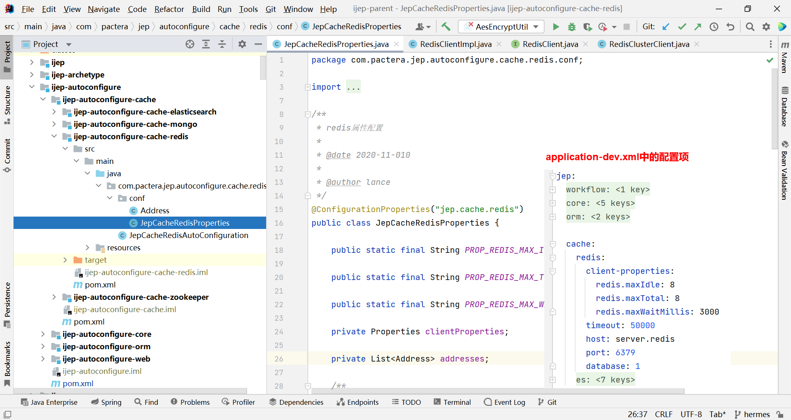

## 2.5 在 iJEP 7 中使用 Redis

iJEP 7 中，我们以 Spring Boot 自动配置的方式，根据是否配置了 Redis 的集群信息在 Spring 容器中创建不同的 RedisClient 实现 Bean，以供需要使用 Redis 服务的客户端注入使用。

### 2.5.1 访问 Redis

在 iJEP 7 中，访问 Redis 的代码落在了 ijep-parent\ijep-middleware\ijep-cache\\**ijep-cache-redis** 工程中：

- RedisClient：操作 Redis 的客户端接口，提供了大量的 Redis 操作方法，有两个实现类；
- RedisClientImpl：操作 Redis 的客户端实现类，实现了 RedisClient 接口；
- RedisClusterClient：操作 Redis 集群的客户端实现类，实现了 RedisClient 接口。

首先，在 ijep-parent\ijep-autoconfigure\ijep-autoconfigure-cache\\**ijep-autoconfigure-cache-redis** 工程中的 JepCacheRedisProperties 引入 Redis 配置信息：



在 JepCacheRedisAutoConfiguration 类中注入 JepCacheRedisProperties 获取项目的 Redis 配置信息，通过 @ConditionalOnProperty 注解根据是否配置 cluster 信息，创建 RedisClientImpl 或 RedisClusterClient Spring Bean，以供后续客户端代码注入使用：

```java
package com.pactera.jep.autoconfigure.cache.redis;
...
@Configuration
@EnableConfigurationProperties(JepCacheRedisProperties.class)
@ConditionalOnProperty(prefix = "jep.cache.redis", value = "enabled", matchIfMissing = true)
public class JepCacheRedisAutoConfiguration {

	@Autowired
	private JepCacheRedisProperties jepCacheRedisProperties;
...
	/**
	 * 单点模式
	 * @return
	 */
	@Bean
	@ConditionalOnMissingBean(RedisClient.class)
	@ConditionalOnProperty(prefix = "jep.cache.redis", name = "cluster", havingValue = "false", matchIfMissing = true)
	public RedisClient redisClient() {
		RedisClientImpl client = new RedisClientImpl();

		client.setConfig(getJedisPoolConfig());
		client.setTimeout(jepCacheRedisProperties.getTimeout());
		client.setHost(jepCacheRedisProperties.getHost());
		client.setPort(jepCacheRedisProperties.getPort());
		client.setDatabase(jepCacheRedisProperties.getDatabase());
		client.setPassword(jepCacheRedisProperties.getPassword());

		return client;
	}

	/**
	 * 集群模式
	 * @return
	 */
	@Bean
	@ConditionalOnMissingBean(RedisClient.class)
	@ConditionalOnProperty(prefix = "jep.cache.redis", name = "cluster", havingValue = "true", matchIfMissing = false)
	public RedisClient getRedisClient() {
		RedisClusterClient client = new RedisClusterClient();

		client.setConfig(getJedisPoolConfig());
		client.setAddress(address2HostAndPort(jepCacheRedisProperties.getAddresses()));
		client.setTimeout(jepCacheRedisProperties.getTimeout());
		client.setMaxAttempts(jepCacheRedisProperties.getMaxAttempts());
		client.setPassword(jepCacheRedisProperties.getPassword());
		client.setSoTimeout(jepCacheRedisProperties.getSoTimeout());

		return client;
	}
...
```

在 RedisClientImpl 中，Spring 容器创建 RedisClientImpl Bean 后（使用注解 @PostConstruct）初始化 JedisPool 连接池，然后在 Spring 容器中供其他客户端注入使用：

> RedisClusterClient 也是同样的实现。

```java
package com.pactera.jep.cache.redis.impl;
...
public class RedisClientImpl implements RedisClient {

    private JedisPoolConfig config;
    /**
     * Jedis连接池
     */
    private JedisPool jedisPool;
...
    /**
     * 初始化连接池
     */
    @PostConstruct
    public void init() {
        if (StringUtils.isEmpty(password)) {
            // 不需要密码
            jedisPool = new JedisPool(config, host, port, timeout, null, database, null);
        } else {
            jedisPool = new JedisPool(config, host, port, timeout, password, database, null);
        }
    }
...
```

以上就是 iJEP 7 平台对 Redis 的封装，如果需要在平台内使用 Redis 功能，就直接注入 RedisClient Bean。

### 2.5.2 授权服务

授权服务中使用了 Redis 存放授权信息。

> 这是个如何在 iJEP 7 中使用 Redis 服务的参考示例，可供在后续项目交付中使用。

在 ijep-sys-parent\\**ijep-sys-core** 工程中，授权服务注入了 RedisClient：

```java
package com.pactera.jep.sys.service.impl;
...
@Service
@Transactional(rollbackFor = Exception.class)
public class AuthorizationServiceImpl extends MyBatisCRUDService<Authorization, String> implements AuthorizationService {
...
    @Autowired
    private RedisClient redisClient;
...
    @Transactional(rollbackFor = Exception.class)
    @Override
    public void saveEntityPermit(String entityCode, String roleId, List<Authorization> authorizations) {
...
            // 删除旧的授权Redis中数据
            redisClient.del(RedisKeyCode.REDIS_AUTHORIZATION_KEY + RedisKeyCode.REDISSEPARATOR
                    + authorization.getEntityCode() + RedisKeyCode.REDISUNDERLINDE
                    + authorization.getAuthType().toLowerCase() + RedisKeyCode.REDISUNDERLINDE
                    + authorization.getAuthRole());

            // 推送到Redis中
            this.syncAuthorization2Redis(filters);
        }
    }
...
}
```

上述代码片段第 15 行，使用 RedisClient 客户端删除 Redis 中的旧的授权数据。