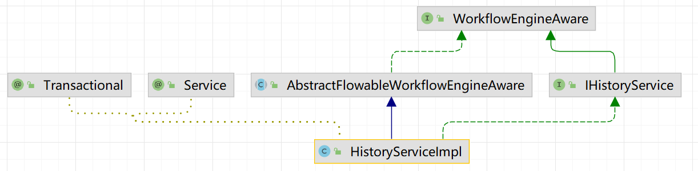

# 第3章 搜索引擎

Elasticsearch 是一个分布式、高扩展、高实时的搜索与数据分析引擎。它能很方便的使大量数据具有搜索、分析和探索的能力。

我们可以在交付的项目中，充分利用 Elasticsearch 的水平伸缩性，能使数据在生产环境变得更有价值。

Elasticsearch 的实现原理主要分为以下几个步骤

1. 首先用户将数据提交到 Elasticsearch 数据库中；
2. 再通过分词控制器去将对应的语句分词，将其权重和分词结果一并存入数据；
3. 当用户搜索数据时候，再根据权重将结果排名，打分，再将返回结果呈现给用户。

Elasticsearch 是与名为 Logstash 的数据收集和日志解析引擎以及名为 Kibana 的分析和可视化平台一起开发的。这三个产品被设计成一个集成解决方案，称为 “Elastic Stack”（以前称为 “ELK stack”）。

根据 DB-Engines 的排名显示，Elasticsearch 是最受欢迎的企业搜索引擎，其次是 Apache Solr，它们都是基于 Apache Lucene。

iJEP 7 使用 Elasticsearch 来存放搜索**数据审计**信息、**工作流**流转审批信息等。

## 3.1 基本概念

**cluster：**代表一个集群，集群中有多个节点，其中有一个为主节点，这个主节点是可以通过选举产生的，主从节点是对于集群内部来说的。es 的一个概念就是去中心化，字面上理解就是无中心节点，这是对于集群外部来说的，因为从外部来看 es 集群，在逻辑上是个整体，你与任何一个节点的通信和与整个 es 集群通信是等价的。

**shards：**代表索引分片，es 可以把一个完整的索引分成多个分片，这样的好处是可以把一个大的索引拆分成多个，分布到不同的节点上。构成分布式搜索。分片的数量只能在索引创建前指定，并且索引创建后不能更改。

**replicas：**代表索引副本，es 可以设置多个索引的副本，副本的作用一是提高系统的容错性，当某个节点某个分片损坏或丢失时可以从副本中恢复。二是提高 es 的查询效率，es 会自动对搜索请求进行负载均衡。

**recovery：**代表数据恢复或叫数据重新分布，es 在有节点加入或退出时会根据机器的负载对索引分片进行重新分配，挂掉的节点重新启动时也会进行数据恢复。

**river：**代表 es 的一个数据源，也是其它存储方式（如：数据库）同步数据到 es 的一个方法。它是以插件方式存在的一个 es 服务，通过读取 river 中的数据并把它索引到 es 中，官方的 river 有 couchDB 的，RabbitMQ 的，Twitter 的，Wikipedia 的。

**gateway：**代表 es 索引快照的存储方式，es 默认是先把索引存放到内存中，当内存满了时再持久化到本地硬盘。gateway 对索引快照进行存储，当这个 es 集群关闭再重新启动时就会从 gateway 中读取索引备份数据。es 支持多种类型的 gateway，有本地文件系统（默认），分布式文件系统，Hadoop 的 HDFS 和 amazon 的 s3 云存储服务。

**discovery.zen：**代表 es 的自动发现节点机制，es 是一个基于 p2p 的系统，它先通过广播寻找存在的节点，再通过多播协议来进行节点之间的通信，同时也支持点对点的交互。

**transport：**代表 es 内部节点或集群与客户端的交互方式，默认内部是使用 tcp 协议进行交互，同时它支持 http 协议（json 格式）、thrift、servlet、memcached、zeroMQ 等的传输协议（通过插件方式集成）。

## 3.2 安装启动

因为 iJEP 7 使用了 Elasticsearch 6 版本，所以本章以版本 6 为例讲解。

> Elasticsearch 7 和 6 版本在 API 层面有不同，所以不能使用最新的 7 版本，后续会升级到 7 版本。

下载 [elasticsearch-6.8.20.zip](https://artifacts.elastic.co/downloads/elasticsearch/elasticsearch-6.8.20.zip) 和  [elasticsearch-analysis-ik-6.8.20.zip](https://github.com/medcl/elasticsearch-analysis-ik/releases/download/v6.8.20/elasticsearch-analysis-ik-6.8.20.zip)（分词器）

解压 elasticsearch-6.8.20.zip 到 `C:\Users\Kevin\iJEP7\run-env\elasticsearch-6.8.20`，解压 elasticsearch-analysis-ik-6.8.20.zip 到 `C:\Users\Kevin\iJEP7\run-env\elasticsearch-6.8.20\plugins\ik` 目录，安装 ik 分词器。

双击 `C:\Users\Kevin\iJEP7\run-env\elasticsearch-6.8.20\elasticsearch-6.8.0\bin\` 下的 elasticsearch.bat 文件，启动 Elasticsearch。

打开浏览器输入 [http://localhost:9200/](http://localhost:9200/)，可查看 ES 是否正确提供服务。


## 3.3 与 ES 交互

我们可以通过两种 Java 客户端与 Elasticsearch 进行交互：

- **节点客户端（Node client）**：节点客户端作为一个非数据节点加入到本地集群中。换句话说，它本身不保存任何数据，但是它知道数据在集群中的哪个节点中，并且可以把请求转发到正确的节点。

- **传输客户端（Transport client）**：轻量级的传输客户端可以将请求发送到远程集群。它本身不加入集群，但是它可以将请求转发到集群中的一个节点上。

两个 Java 客户端都是通过 9300 端口并使用 Elasticsearch 的原生传输协议和集群交互。集群中的节点通过端口 9300 彼此通信。如果这个端口没有打开，节点将无法形成一个集群。

> Java 客户端作为节点必须和 Elasticsearch 有相同的主要版本（如同时为版本 6.x.x）；否则，它们之间将无法互相通信。

iJEP 7 中使用的是 Elasticsearch 6，所以运行时不能选择 ES 7。


> iJEP 7 的根项目 ijep-parent/pom.xml 中指定了 <elasticsearch.version>6.4.3</elasticsearch.version>
>
> ijep-parent\ijep-middleware\ijep-cache\ijep-cache-elasticsearch\pom.xml 中引入了 org.elasticsearch.elasticsearch 和 org.elasticsearch.client.transport

所有其他语言可以使用 RESTful API 通过端口 9200 和 Elasticsearch 进行通信，你可以用你最喜爱的 web 客户端访问 Elasticsearch 。事实上，正如你所看到的，你甚至可以使用 `curl` 命令来和 Elasticsearch 交互。

一个 Elasticsearch 请求和任何 HTTP 请求一样由若干相同的部件组成：

```js
curl -X<VERB> '<PROTOCOL>://<HOST>:<PORT>/<PATH>?<QUERY_STRING>' -d '<BODY>'
```

被 `< >` 标记的部件：

| `VERB`         | 适当的 HTTP *方法* 或 *谓词* : `GET`、 `POST`、 `PUT`、 `HEAD` 或者 `DELETE`。 |
| -------------- | ------------------------------------------------------------ |
| `PROTOCOL`     | `http` 或者 `https`（如果你在 Elasticsearch 前面有一个 `https` 代理） |
| `HOST`         | Elasticsearch 集群中任意节点的主机名，或者用 `localhost` 代表本地机器上的节点。 |
| `PORT`         | 运行 Elasticsearch HTTP 服务的端口号，默认是 `9200` 。       |
| `PATH`         | API 的终端路径（例如 `_count` 将返回集群中文档数量）。Path 可能包含多个组件，例如：`_cluster/stats` 和 `_nodes/stats/jvm` 。 |
| `QUERY_STRING` | 任意可选的查询字符串参数 (例如 `?pretty` 将格式化地输出 JSON 返回值，使其更容易阅读) |
| `BODY`         | 一个 JSON 格式的请求体 (如果请求需要的话)                    |

例如，计算集群中文档的数量，我们可以用这个：

```js
curl -XGET 'http://localhost:9200/_count?pretty' -d '
{
    "query": {
        "match_all": {}
    }
}
'
```

或使用 Postman 发送请求，能够更清晰的看到返回结果


Elasticsearch 返回一个 HTTP 状态码（例如：`200 OK`）和（除`HEAD`请求）一个 JSON 格式的返回值。前面的 `curl` 请求将返回一个像下面一样的 JSON 体：

```js
{
    "count": 8,
    "_shards": {
        "total": 15,
        "successful": 15,
        "skipped": 0,
        "failed": 0
    }
}
```

在返回结果中没有看到 HTTP 头信息是因为我们没有要求`curl`显示它们。想要看到头信息，需要结合 `-i` 参数来使用 `curl` 命令：

```js
curl -i -XGET 'localhost:9200/'
```


在日常开发工作中，可以方便地通过 Postman 使用 [RESTful API](https://www.elastic.co/guide/en/elasticsearch/reference/current/rest-apis.html) 与 ES 通讯，在 iJEP 7 开发的应用中验证数据或排查程序错误。

## 3.4 Spring Boot 集成 ES

我们以 Spring Data 的方式集成 ES，并给出最简单的示例，供你参考。

在 IDEA 中创建一个测试项目：


选择 Spring Web 和 Elasticsearch 依赖： 


在生成的项目中，查看 Spring Boot 集成的 Elasticsearch 版本为 7.15.2，去官网下载对应的 [Elasticsearch](https://artifacts.elastic.co/downloads/elasticsearch/elasticsearch-7.15.2-windows-x86_64.zip)：


在 application.yml 文件中配置 Elasticsearch 服务器地址和端口：

```yaml
data:
  elasticsearch:
    cluster‐nodes: 127.0.0.1:9300
```

创建 Enity 类：

```java
package com.gientech.ijep.es.example.springbootes.entity;

import org.springframework.data.annotation.Id;
import org.springframework.data.elasticsearch.annotations.Document;
import org.springframework.data.elasticsearch.annotations.Field;
import org.springframework.data.elasticsearch.annotations.FieldType;

import java.io.Serializable;

@Document(indexName = "document")
public class DocumentEntity implements Serializable {
    @Id
    private String documentID;
    @Field(index = true, analyzer = "ik_max_word", searchAnalyzer = "ik_max_word", type = FieldType.Text)
    private String documentName;

    public String getDocumentID() {
        return documentID;
    }

    public void setDocumentID(String documentID) {
        this.documentID = documentID;
    }

    public String getDocumentName() {
        return documentName;
    }

    public void setDocumentName(String documentName) {
        this.documentName = documentName;
    }
}
```

创建 DAO 接口：

```java
package com.gientech.ijep.es.example.springbootes.dao;

import com.gientech.ijep.es.example.springbootes.entity.DocumentEntity;
import org.springframework.data.elasticsearch.repository.ElasticsearchRepository;

public interface DocumentDao extends ElasticsearchRepository<DocumentEntity, String> {
}
```

创建 Service 类：

```java
package com.gientech.ijep.es.example.springbootes.service;

import com.gientech.ijep.es.example.springbootes.dao.DocumentDao;
import com.gientech.ijep.es.example.springbootes.entity.DocumentEntity;
import org.springframework.beans.factory.annotation.Autowired;
import org.springframework.stereotype.Service;

@Service
public class DocumentService {
    @Autowired
    private DocumentDao documentDao;

    public void add(DocumentEntity document) {
        documentDao.save(document);
    }

    public DocumentEntity findById(String documentID) {
        return documentDao.findById(documentID).get();
    }
}
```

创建 Controller 类：

```java
package com.gientech.ijep.es.example.springbootes.controller;

import com.gientech.ijep.es.example.springbootes.entity.DocumentEntity;
import com.gientech.ijep.es.example.springbootes.service.DocumentService;
import org.springframework.beans.factory.annotation.Autowired;
import org.springframework.web.bind.annotation.RequestMapping;
import org.springframework.web.bind.annotation.RequestMethod;
import org.springframework.web.bind.annotation.RestController;

@RestController
public class DocumentController {
    @Autowired
    DocumentService documentService;

    @RequestMapping(value = "/es/add", method = RequestMethod.POST)
    public String add(String documentID, String documentName) {
        DocumentEntity document = new DocumentEntity();
        document.setDocumentID(documentID);
        document.setDocumentName(documentName);
        documentService.add(document);
        return "创建成功";
    }

    @RequestMapping(value = "/es/findById", method = RequestMethod.POST)
    public DocumentEntity findById(String documentID) {
        return documentService.findById(documentID);
    }
}
```

修改启动类，添加 @EnableElasticsearchRepositories 注解：

```java
package com.gientech.ijep.es.example.springbootes;

import org.springframework.boot.SpringApplication;
import org.springframework.boot.autoconfigure.SpringBootApplication;
import org.springframework.data.elasticsearch.repository.config.EnableElasticsearchRepositories;

@SpringBootApplication
@EnableElasticsearchRepositories
public class SpringbootEsApplication {

    public static void main(String[] args) {
        SpringApplication.run(SpringbootEsApplication.class, args);
    }

}
```

启动应用，使用 Postman 测试添加和查询功能：、

- 测试添加功能：


- 测试查询功能：


## 3.5 在 iJEP 7 中使用 ES

iJEP 7 中我们是以另外一种方式（TransportClient ）在 9300 端口上使用 Elasticsearch。

### 3.5.1 访问 Elasticsearch

在 iJEP 7 中，访问 Elasticsearch 的代码落在了 ijep-parent\ijep-web\\**ijep-web-api** 工程中：

- ESClientPool：Elasticsearch 客户端连接池，减少创建/关闭连接的开销；
- ESClient：Elasticsearch 工具类，提供 insert、get 和 query 方法。

首先，在 ijep-parent\ijep-autoconfigure\ijep-autoconfigure-cache\\**ijep-autoconfigure-cache-elasticsearch** 工程中的 JepConfigurationESProperties 引入 Elasticsearch 配置信息：


然后在 ESConfiguration 类中定义了名称为 esPoolConfig 的 bean，其使用了上面 JepConfigurationESProperties 这个配置信息：


在 ESClientPool 这个 Elasticsearch 客户端连接池的构造方法中，创建 TransportClient 类型的对象连接池：

```java
package com.pactera.jep.web.client
...
public enum ESClientPool {

	// 对象池的实例对象
	INSTANCE;

	private ObjectPool<TransportClient> pool;

	private static final Logger logger = LoggerFactory.getLogger(ESClientPool.class);

	private ESClientPool() {
		pool = new GenericObjectPool<>(new ESClientFactory(), SpringContextHolder.getBean("esPoolConfig"));
	}
...
```

提供 insert 方法供 ESClient 调用：

```java
public boolean insert(Object data, String id, String indexCode, String typeName, ESConfigurationProperties configurationProperties) {
    if (null == data) {
        throw new ServiceException("传入的待插入数据为空！");
    }
    TransportClient client = null;
    try {
        client = ESClientPool.INSTANCE.getClient();
        if (client == null) { throw new ServiceException("获取TransportClient实例失败！");  }

        // 如果INDEX_NAME_PROC_INST不存在的话，就创建这个index，然后再将数据插入
        boolean acknowledged = ESClientPool.INSTANCE.createIndexIfNotExist(client, indexCode, typeName, configurationProperties.getMaxWaitMillis());
        if (!acknowledged) {
            throw new ServiceException("序列" + indexCode + "不存在且创建失败！");
        }
        // 首先将对象转化成json字符串
        String jsonString = JSON.toJSONString(data);
        // 然后将数据插入es中
        IndexRequest indexRequest = new IndexRequest(indexCode, typeName, id);
        indexRequest.source(jsonString, XContentType.JSON);
        IndexResponse response = client.index(indexRequest).get(configurationProperties.getMaxWaitMillis(), TimeUnit.MILLISECONDS);
        if (response == null || response.getShardInfo().getSuccessful() == 0) {
            throw new ServiceException("数据插入失败！");
        }
        return true;
    } catch (Exception e) {
        throw new ServiceException("插入数据至ElasticSearch时出现异常", e);
    } finally {
        if (client != null) {
            try {
                ESClientPool.INSTANCE.returnClient(client);
            } catch (Exception e) {
                logger.error("归还es连接时出现异常：{}", e.getMessage());
            }
        }
    }
}
```

上面代码片段的说明：

- 第 11 行：如果没有这个索引，就创建这个索引；
- 第 20 行：将当前记录（数据为 data 的 json 串，主键为 id）通过 client（类型是 TransportClient） 插入到 indexCode 索引中。

面向客户的 ESClient 工具类，提供 insert，get 和 query 方法：

```java
package com.pactera.jep.cache.es.client;
...
public class ESClient {

    public boolean insert(Object data, String id, String indexCode, String typeName, ESConfigurationProperties configurationProperties) {
        return ESClientPool.INSTANCE.insert(data, id, indexCode, typeName, configurationProperties);
    }

    public Object get(String code, String value, Class entityClass, String indexCode, String typeName, ESConfigurationProperties configurationProperties) {
        return ESClientPool.INSTANCE.get("id", value, entityClass, indexCode, typeName, configurationProperties);
    }

    public void query(List<Filter> filters, List<Order> orders, Page page, Class entityClass, String indexCode, String typeName, ESConfigurationProperties configurationProperties) {
        ESClientPool.INSTANCE.query(filters, orders, page, entityClass, indexCode, typeName, configurationProperties);
    }
}
```

以上就是 iJEP 7 平台对 Elasticsearch 的封装，如果需要在平台内使用 Elasticsearch 功能，就直接使用 ESClient 工具类。

### 3.5.2 数据审计

iJEP 7 平台的数据审计功能是由平台提供的，可配置的，应用代码无侵入的系统基础功能。

使用平台功能**“系统管理 > 系统配置 > 应用参数配置”**，启用数据审计功能，并选择需要审计的业务模型：


在  ijep-parent\ijep-web\\**ijep-web-api** 工程的中央控制器 ApplicationDispatcherController 类的 execute 方法中会向 SmartformUtils.forward 传递 dataAuditService（类型：DataAuditService，实现：ESDataAuditServiceImpl）：

```java
package com.pactera.jep.web.controller;
...
@RestController
@RequestMapping("/app")
@Api(tags = "中央控制器")
public class ApplicationDispatcherController {
    @Autowired
    private DataAuditService dataAuditService;
...    
    @ApiOperation(value = "通用方法")
    @PostMapping(value = {"/execute"})
    public RestResponse execute(HttpServletRequest request) {
        RestRequest restRequest = RequestUtils.buildRestRequest(request);
        return SmartformUtils.forward(restRequest, applicationServiceInvoker, dataAuditService);
    }
...
}
```

在智能表单工具类 SmartformUtils 的 forward 方法中处理数据审计：

```java
package com.pactera.jep.web.util;
...
public class SmartformUtils {
...
    /**
     * 业务实现类转发器
     *
     * @param restRequest               数据报文
     * @param applicationServiceInvoker 执行通用方法器
     * @param dataAuditService          数据审计
     * @return
     */
    public static RestResponse forward(RestRequest restRequest, ApplicationServiceInvoker applicationServiceInvoker, DataAuditService dataAuditService) {
        RestResponse restResponse;
        String action = restRequest.getAction();
...
        // 数据审计
        List<AuditEntity> auditEntityList = Context.getApplicationContext().getApplication().getAuditEntityList();
        if (CollectionUtils.isNotEmpty(auditEntityList)) {
            dataAuditService.insert(auditEntityList);
        }

        return restResponse;
    }
}
```

实际上处理数据审计的代码在 ESDataAuditServiceImpl 的 insert 方法中：

```java
package com.pactera.jep.web.service.impl;
...
@Service
public class ESDataAuditServiceImpl implements DataAuditService{
    @Autowired
    private JepConfigurationESProperties jepConfigurationESProperties;
    @Override
    public void insert(List<AuditEntity> auditEntities) {
        // 1、开启异步线程处理数据审计信息
        new Thread() {
            @Override
            public void run() {
                //2、循环处理数据审计压栈数据
                auditEntities.forEach(auditEntity -> {
                    //3、调用数据审计业务实现
                    ESClient.insert(auditEntity, auditEntity.getId(), ESKeyCode.ES_AUDIT_INDEX_CODE, ESKeyCode.ES_AUDIT_TYPE_NAME, jepConfigurationESProperties);
                });
            }
        }.start();
    }
...
}
```

上述代码第 16 行，调用 ESClient 类的 insert 方法，将数据审计数据异步索引到 Elasticsearch 中。

### 3.5.3 工作流

iJEP 7 平台的工作流服务，为了加快业务审批记录查找减轻引擎运行时压力，我们将流程实例的审批记录（历史数据）存放在 Elasticsearch 中。

其历史数据主要通过 ijep-bpm-parent\\**ijep-bpm-server** 工程中的 HistoryServiceImpl 类来完成：



```java
package com.pactera.jep.workflow.impl.service;
...
@Service
@Transactional(readOnly = true)
public class HistoryServiceImpl extends AbstractFlowableWorkflowEngineAware implements IHistoryService {
...
	/**
	 * 同步历史数据到ES中
	 * @param page
	 */
	private void syncHistoryProcInst(Page<HisBprocInst> page) {
		page.getResult().forEach(hisProcInst -> {
			if (workflowEngine.getHistoryService().insertProcInst(hisProcInst)) {
				// 同步成功，删除数据
				this.workflowEngine.getHisBprocInstService().delete(hisProcInst);
				ProcInstData procInstData = workflowEngine.getProcInstDataService().get(new Filter.Builder().eq("bprocInstId", hisProcInst.getId()).build());
				if (null != procInstData) {
					if (workflowEngine.getProcessInstDataService().insertProcInstData(procInstData)) {
						// 同步成功，删除数据
this.workflowEngine.getHisBprocInstService().delete(hisProcInst);
					} else {
						logger.error("同步业务数据失败：id={}", procInstData.getId());
						throw new WorkflowException("同步业务数据失败");
					}
				}
			}
		});
	}
...
}
```

上述代码片段第 18 行 `workflowEngine.getProcessInstDataService().insertProcInstData(procInstData)` 调用 ProcessInstDataService 类的 insertProcInstData 方法向 Elasticsearch 中索引流程实例数据（参数procInstData）：

```java
package com.pactera.jep.workflow.impl.service;
...
/**
 * @description: 流程业务数据
 * @author: Lance
 * @create: 2021-01-28
 **/
@Service
@Transactional(readOnly = true)
public class ProcessInstDataService extends AbstractFlowableWorkflowEngineAware implements IProcessInstDataService {
...
    @Override
    public boolean insertProcInstData(IProcInstData procInstData) throws WorkflowException {
        return ESClientPool.INSTANCE.insert(procInstData, procInstData.getId(), ESIndexCode.ES_PROC_INST_DATA, ESIndexCode.ES_TYPE_NAME, configurationProperties);
    }
...
}
```

上述代码片段第 14 行，通过 ESClientPool Elasticsearch 客户端连接池将流程数据索引到 Elasticsearch。

> 显然，ESClientPool.INSTANCE.insert 应该重构成 ESClient.insert...
>
> 进一步，基于事件驱动设计架构，可发布事件 > 事件采用消息驱动，完成异步解耦。
