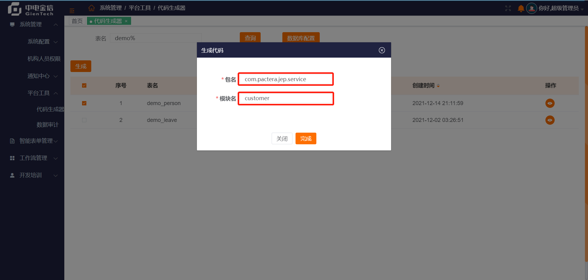
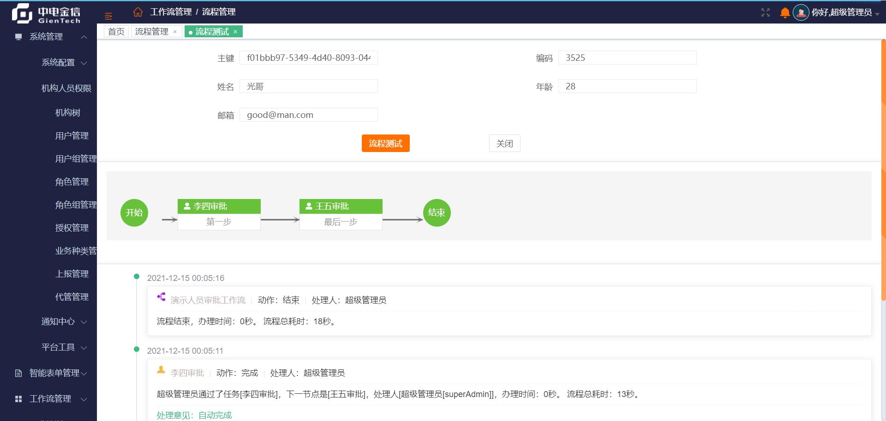
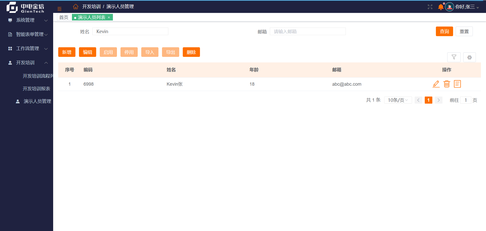
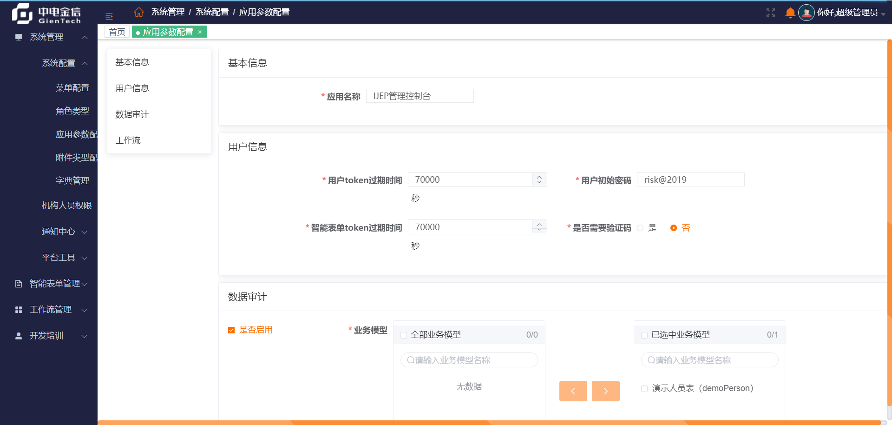
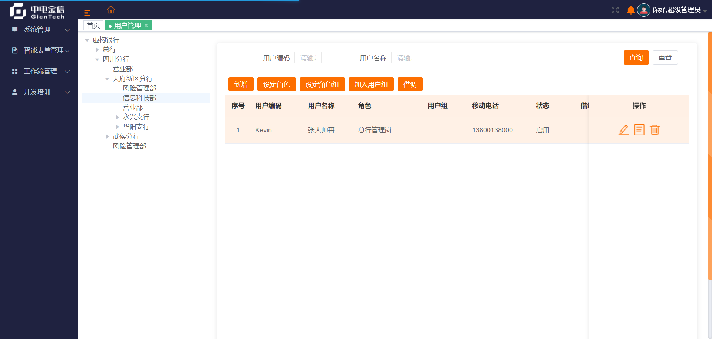
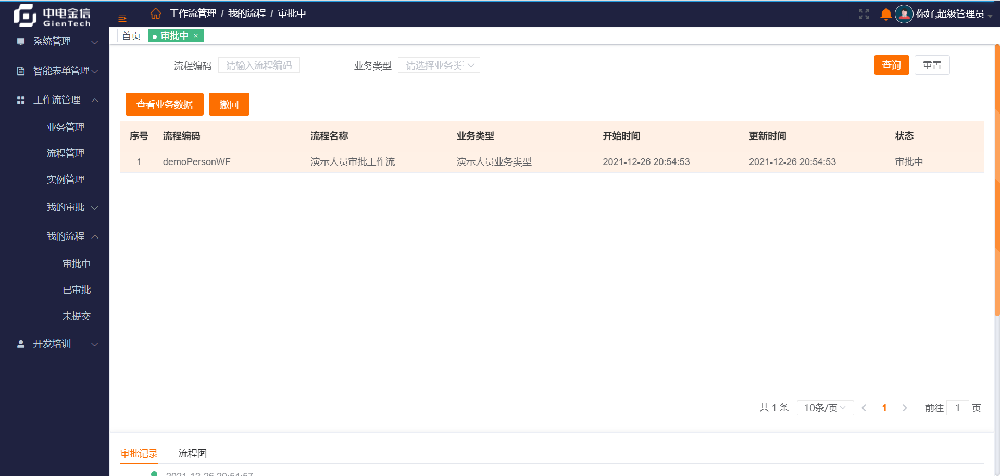

# 第5章 快速开始

在上一章中，我们介绍了安装部署 iJEP 7 的详细步骤。

这一章，我们首先以无代码的形式（不用手写一行代码，虽然当前代码生成器还存在缺陷需要手写骨架代码，后续会修正这个缺陷）开发配置一个 CRUD 的列表表单功能。然后，设计一个两个节点的工作流模板，并配置流程列表智能表单完成工作流审批功能。

以上场景为 iJEP 7 最常用的业务场景，我们的 Quick Start 就以此为开始。

> 开发配置过程中使用的用户为 superAdmin，密码是 123456

## 5.1 创建数据库表

使用如下脚本创建 MySQL 数据库表 demo_person：

```sql
CREATE TABLE `demo_person` (
  `id_` varchar(64) COLLATE utf8_bin NOT NULL COMMENT '主键',
  `code_` varchar(32) COLLATE utf8_bin DEFAULT NULL COMMENT '编码',
  `name_` varchar(64) COLLATE utf8_bin DEFAULT NULL COMMENT '姓名',
  `age_` int(11) DEFAULT NULL COMMENT '年龄',
  `mail_` varchar(128) COLLATE utf8_bin DEFAULT NULL COMMENT '邮箱',
  `WF_ID_` varchar(32) CHARACTER SET utf8 DEFAULT NULL COMMENT '流程实例ID',
  `WF_STATUS_` varchar(32) CHARACTER SET utf8 DEFAULT NULL COMMENT '流程审批状态',
  `WF_TASK_ID_` varchar(32) CHARACTER SET utf8 DEFAULT NULL COMMENT '流程任务实例ID',
  `GROUP_CODE_` varchar(64) CHARACTER SET utf8 DEFAULT NULL COMMENT '租户',
  `CREATED_BY_ID_` varchar(64) CHARACTER SET utf8 DEFAULT NULL COMMENT '创建人ID',
  `CREATED_BY_NAME_` varchar(64) CHARACTER SET utf8 DEFAULT NULL COMMENT '创建人名称',
  `CREATED_TIME_` datetime DEFAULT NULL COMMENT '创建时间',
  `MODIFIED_BY_ID_` varchar(64) CHARACTER SET utf8 DEFAULT NULL COMMENT '修改人ID',
  `MODIFIED_BY_NAME_` varchar(64) CHARACTER SET utf8 DEFAULT NULL COMMENT '修改人名称',
  `MODIFIED_TIME_` timestamp NOT NULL DEFAULT CURRENT_TIMESTAMP ON UPDATE CURRENT_TIMESTAMP COMMENT '修改时间',
  `OWNER_CODE_` varchar(64) CHARACTER SET utf8 DEFAULT NULL COMMENT '所有人编码',
  `OWNER_NAME_` varchar(128) CHARACTER SET utf8 DEFAULT NULL COMMENT '所有人名称',
  `OWNER_ORG_CODE_` varchar(64) CHARACTER SET utf8 DEFAULT NULL COMMENT '所属机构编码',
  `OWNER_ORG_NAME_` varchar(128) CHARACTER SET utf8 DEFAULT NULL COMMENT '所属机构名称',
  `OWNER_DEPT_CODE_` varchar(64) CHARACTER SET utf8 DEFAULT NULL COMMENT '所属部门编码',
  `OWNER_DEPT_NAME_` varchar(128) CHARACTER SET utf8 DEFAULT NULL COMMENT '所属部门名称',
  `DELFLAG_` varchar(1) CHARACTER SET utf8 DEFAULT NULL COMMENT '逻辑删除标记',
  `REV_` int(11) DEFAULT NULL COMMENT '版本',
  PRIMARY KEY (`id_`) USING BTREE
) ENGINE=InnoDB DEFAULT CHARSET=utf8 COLLATE=utf8_bin COMMENT='演示人员表';
```

## 5.2 生成骨架代码

访问**”系统管理 > 平台工具 > 代码生成器“**菜单，打开 iJEP 7 平台提供的代码生成器，设置“数据库配置”信息，测试后保存，连接到开发数据库：


在表名输入框中输入 demo% 单击**查询**按钮，然后选中 demo_person 表这一行，单击**生成**按钮：


输入包名 com.pactera.jep.service，服务名 customer，然后单击**完成**按钮：



稍等，可在下载目录中找到“iJEP_20211214211935.zip”文件，这个文件就是生成的骨架代码文件。

> 当前代码生成器生成的代码（7 个文件），针对工作流场景的骨架代码有 3 个缺陷，见后续步骤说明。

## 5.3 在 IDEA 中调整骨架代码

将生成的骨架代码文件拷贝到 IDEA 中，并做简单调整（后续代码生成器修正后就无需调整）。

> <font color = "red">当前版本代码生成模板还有点儿问题，请手动删除实体 DemoPerson.java 中的 wfTaskId 属性和对应的 getter、setter 方法，原因是基类 BpmPO 中有这个属性。</font>


手工创建流程服务类接口 **DemoPersonBpmApplicationService**：

```java
package com.pactera.jep.service.customer.service;

import com.pactera.jep.service.customer.model.DemoPerson;
import com.pactera.jep.web.service.BpmApplicationService;

public interface DemoPersonBpmApplicationService extends BpmApplicationService<DemoPerson, String> {

    String beanId = "demoPersonBpmApplicationService";
}
```

手工创建流程服务实现类 **DemoPersonBpmApplicationServiceImpl**：

```java
package com.pactera.jep.service.customer.service.impl;

import com.pactera.jep.core.exception.ServiceException;
import com.pactera.jep.orm.service.CRUDService;
import com.pactera.jep.service.customer.model.DemoPerson;
import com.pactera.jep.service.customer.service.DemoPersonBpmApplicationService;
import com.pactera.jep.service.customer.service.DemoPersonService;
import com.pactera.jep.web.service.impl.AbstractBpmApplicationService;
import org.springframework.beans.factory.annotation.Autowired;
import org.springframework.stereotype.Service;
import org.springframework.transaction.annotation.Transactional;

@Service(DemoPersonBpmApplicationService.beanId)
@Transactional(rollbackFor = ServiceException.class)
public class DemoPersonBpmApplicationServiceImpl extends AbstractBpmApplicationService<DemoPerson, String> implements DemoPersonBpmApplicationService {

    @Autowired
    private DemoPersonService demoPersonService;


    @Override
    public CRUDService<DemoPerson, String> getCrudService() {
        return demoPersonService;
    }
}
```

> <font color = "red">当前版本代码生成器缺失工作流服务接口和实现类模板，请手动创建上述工作流服务接口和实现类。</font>

启动开发示例服务 customer：


## 5.4 配置智能表单

访问**“智能表单管理 > 业务模型”**菜单，检查是否自动扫描到了 demoPerson 实体模型：


访问**“智能表单管理 > 智能表单”**，选中“开发培训”分类，单击**新增**按钮：


### 5.4.1 编辑表单

选择**“仅编辑”**表单设计模板，输入“编码、名称”信息，选择“业务模型、业务实现”后单击**保存**按钮：


单击**“设计页”** tab，设计编辑表单：


添加编辑字段并设置其属性，然后**保存**：


选择**”权限管理“** tab，为”总行管理岗“设置本编辑表单的组织权限（数据权限）和字段权限：


然后启用本表单。

### 5.4.2 显示表单

将编辑表单复制为仅显示的表单：


输入“编码”和“名称”，然后单击**保存**按钮，生成显示表单：


选择**”权限管理“** tab，为”总行管理岗“设置本显示表单的组织权限（数据权限）和字段权限：


然后启用本表单。

### 5.4.3 列表表单

新增智能表单，选择**“仅列表”**表单设计模板，输入“编码、名称”信息，选择“业务模型、业务实现”后单击**保存**按钮：


添加查询条件，设置表格列属性，然后单击**保存**按钮，完成列表表单设计：


为列表表单上的按钮绑定对应的智能表单：


选择”权限管理“ tab，为”总行管理岗“设置本列表表单的组织权限（数据权限）、字段权限和功能权限：


然后启用本表单。

### 5.4.4 流程列表

在完成流程模板配置并启用该流程后，才可配置流程列表。

通常的业务场景是在一个列表界面提交审批来启动一个流程实例。

新建一个智能表单，选择**“流程列表”**模板，并填写相关属性值，单击**保存**按钮：


在**“设计页”** tab 添加查询条件，设置工具栏按钮，并为按钮指定智能表单，为表格添加列，然后单击**保存**按钮：


需要注意的是流程列表表单需要在表格的通用属性上设定**“业务种类”**和**“流程”**：

> 如果忘记设置“业务种类”和“流程”这两个属性，则在后续“提交”启动流程时会报<font color=red>btypeCode不能为空</font>错误。


选择**”权限管理“** tab，为”总行管理岗“设置本流程列表表单的组织权限（数据权限）、字段权限和功能权限：


然后启用本表单。

## 5.5 配置工作流

配置工作流，需要先配置业务类型，然后再配置流程模板。

### 5.5.1 新增业务类型

访问**“工作流管理 > 业务管理”**菜单，新增一个业务类型：


> 因为要选择智能表单，所以需要先配置 DemoPerson 实体的编辑/显示表单。

### 5.5.2 设计流程模板

访问**“工作流管理 > 流程管理”**菜单，新增一个流程模板，输入“编码、名称”信息，并选择“类型、智能表单和业务服务”属性，然后**保存**：


选中上一步新增的流程模板，单击**设计**按钮：


添加两个人工节点，设置其任务审批候选人等信息，为任务节点挂接智能表单：

> 简单起见，这里使用了指定审批人任务分配策略，第一步审批人为 lisi，最后一步审批人为 wangwu


保存后，选中该流程并测试该流程。

在流程测试界面，填写相关信息后，单击**流程测试**按钮，可自动的测试该流程是否可正确流转：


流程测试完成，可查看流程流转记录：



通过测试的流程，可在流程管理列表中启用该流程，供后续业务开发用：


## 5.6 配置菜单

访问**”系统管理 > 系统配置 > 菜单配置“**菜单，在”开发培训“菜单下的”员工请假报表“菜单上右键单击，选择”增加同级“菜单：


输入”菜单编码、菜单名称“等信息，选择对应的”演示人员列表“智能表单，然后单击**保存**按钮：


以同样的方法添加“演示人员管理-流程”菜单：


## 5.7 授权

访问**”系统管理 > 机构人员权限 > 授权管理“**菜单，为”总行管理岗“授权上面配置好的”演示人员管理“菜单权限：


为”30110 总行管理岗“授权”演示人员管理“菜单：


为”30110 总行管理岗“授权”演示人员管理-流程“菜单：


## 5.8 测试

完成上面的配置后，我们分两个场景来测试验证配置是否正确。

测试过程中会用到 zhangsan、lisi 和 wangwu 三个用户，他们的密码都是 123456。

### 5.8.1 测试”演示人员管理“功能

使用 ”zhangsan“ 用户（总行管理岗）登录系统后，访问**”开发培训 > 演示人员管理“**菜单，单击**新增**按钮，输入对应的字段值，注意邮箱输入框带校验功能：

可在列表界面中查看到上面添加的”Kevin张“人员信息，同时可以观察到在列表表单中配置的功能权限（启用、停用、导入、导出按钮不可用）：


输入姓名”Kevin“可模糊查询到数据：



输入姓名”Kevin李“查找结果为空，验证测试条件功能生效：


单击**编辑**按钮，以新页面的形式展示编辑表单：

> 新增按钮设置为”弹窗“，和编辑的”新页面“显示效果不一样。


单击操作列中的**显示**按钮，展示显示表单：


### 5.8.2 测试”演示人员管理-流程“功能

使用 ”zhangsan“ 用户（总行管理岗）登录系统后，访问**”开发培训 > 演示人员管理-流程“**菜单，单击**新增**按钮，输入对应的字段值，注意邮箱输入框带校验功能：


在列表页面，选中上面新增的人员，并单击**提交**按钮，启动审批流程：


提交后，系统会提示“流程启动成功”：

> 如果“提交”启动流程时报<font color=red>btypeCode不能为空</font>错误，原因是没有为流程列表的表格设定“业务种类”和“流程”这两个属性，也就是说，这个流程列表智能表单的表格没有绑定到工作流模板。


选中“张大帅哥”这条记录，单击**查看审批流程**按钮，可查看当前流程的流转情况，可看到下一节点是由 lisi 审批：


使用 ”lisi“ 用户（总行管理岗）登录系统后，访问**”工作流管理 > 我的审批 > 待审批“**菜单，选中“演示人员审批工作流”这条记录，单击**处理**按钮：


填写处理意见后，单击**同意**按钮，完成审批：


换 ”zhangsan“ 用户（总行管理岗）登录系统后，访问**”开发培训 > 演示人员管理-流程“**菜单，选中“张大帅哥”这条记录，单击**查看审批流程**按钮，可查看当前流程李四已经审批，下一步由王五审批：


## 5.9 平台功能介绍

iJEP 7 平台通过规范接口、基类、设计工具提供开发时支持的同时，也提供运行时管理配置功能减少项目交付启动工作量。这些设计时工具和管理配置类功能构成了随平台初始交付的功能。本节详细介绍这些功能。

### 5.9.1 系统管理

系统管理功能都位于平台的**系统管理**菜单部分，主要提供配置、机构人员权限、通知和平台代码生成工具等功能。

#### 5.9.1.1 系统配置

iJEP 7 平台针对银行的层级（水平切分：总分支）和业务条线（垂直切分：零售条线、批发条线、信贷业务线）做了组织机构的设计，并在 2015 年服务证券行业时扩展了组织机构的代管（从上往下）关系和汇报（从下往上）关系。

在上述组织机构的基础上，我们按照 RBAC 规范设计了系统的权限系统。

为了让平台更加灵活，我们还提供了一些系统配置功能，以动态改变平台运行期行为。

##### 5.9.1.1.1 菜单配置

菜单在平台中表现为一种资源，是用户操作的主要入口，也是角色授权的标的物。

菜单管理是用来配置平台使用的菜单。

通常，我们开发完一个功能后，通过菜单配置将其加入平台，后续再将其授权给某个角色，在拥有这个角色的用户登录系统后，就可以操作这个菜单。


菜单管理功能中：

1. 菜单级别：分为业务、管理和不控制。业务代表业务功能管理员不能使用，管理代表管理业务人员不能使用，不控制则业务人员和管理员都可以使用；
2. 显示序号：在树形菜单机构中，同级的兄弟菜单节点的显示顺序；
3. 是否可见：该菜单在角色授权功能中是否可见；
4. 是否有效：该菜单是否有效；
5. 公共模块：如果选中，则平台登录人员都可以使用这个菜单，不需要授权，通常某些公共查询功能、消息中心等会设置为公共模块；
6. 智能表单：菜单连接的资源入口，支持输入中文过滤，方便快速选择。

##### 5.9.1.1.2 角色类型

平台为了更好地支持条线管理中的向上审批需求，提供了角色类型（标准角色、标准岗位）功能。

比如支行合规岗寻求上级审批通常是指分行合规岗，那么支行合规岗和分行合规岗都是属于合规岗，那么合规岗就是一个典型的角色类型或者说是一个标准角色。


##### 5.9.1.1.3 应用参数配置

应用参数配置完成对系统中的基本行为控制。

在开发期决定了平台的配置项并在平台的代码中使用这些配置项，在运行期可以对配置项的值进行设定。

如应用名称设定、token 超时时间、对哪些业务模型进行数据审计等配置。



##### 5.9.1.1.4 附件类型配置

使用平台开发的系统，多数都会使用到附件功能，我们提供附件类型功能，对附件进行分类管理。


##### 5.9.1.1.5 字典管理

平台内设计了两种字典：

1. 固定的字典：使用 @FixedDict 注解标注的枚举类，平台代码强依赖其值，不能随意改变；
2. 数据字典：通过字典管理功能配置到数据库中，可增加、修改其值，多数用在业务功能的下拉选择框中。

字典是个典型的主子表功能，分为字典和字典项两部分。


#### 5.9.1.2 机构人员权限

机构人员权限部分维护了系统中的机构、人员极其归属关系。

平台为了方便权限管理，在角色类型（role_std）、角色（role）的基础上，后台还通过程序自动维护了职位（position）和职责（duty）两种关系，以更好地支持工作流流转。

##### 5.9.1.2.1 机构树

机构树维护了系统内的组织机构层级关系。

机构具有对应的状态、是否为业务部门和业务种类等属性。

在机构层级上具有相同业务种类的机构就构成了业务条线。


##### 5.9.1.2.2 用户管理

用户管理维护平台内机构上的人员。

平台通过在组织机构的部门上维护员工（staff），内部实现还有一张用户（user）表来管理登录密码等信息。

新建用户的初始密码在**应用参数配置**功能中设定。



新增用户时，可以同时选择用户所属的用户组、角色和角色组。


##### 5.9.1.2.3 用户组管理

用户组是对用户的分组，方便后续授权管理。

用户组可以包含多个用户，可以关联角色、角色组，以便批量将权限授予一个组中的人员。


##### 5.9.1.2.4 角色管理

角色是系统内主要的权限承载者。

角色是通过机构层级和角色类型组合而成的，是角色类型在某个机构层级上的具化。


新增角色时，选择机构层级和角色类型，自动合成角色编码，输入角色名称，后保存。


##### 5.9.1.2.5 角色组管理

角色组是对角色的归类，进一步方便后续授权操作。


新增角色组后，可以为角色组设置包含的角色。

##### 5.9.1.2.6 授权管理

授权管理是将平台管理的资源关联到角色上，以便后续通过用户拥有的角色将资源访问权限传递到登录用户上。


选择角色后进行授权，在授权界面中选择系统中的菜单，完成授权。


##### 5.9.1.2.7 业务种类管理

业务种类管理中配置完业务种类，供机构管理时关联以形成业务条线关系。


##### 5.9.1.2.8 上报管理

上报管理维护了下级机构向上级机构的汇报关系，以供灵活的工作流审批角色、人员选择策略的实现使用。


##### 5.9.1.2.9 代管管理

代管管理维护了上级对下级除了总分支层面、业务条线层面上的管理关系。比如一家新的分公司，由总部的某部门进行代管。


#### 5.9.1.3 通知中心

通知中心是系统内的信息传递场所，处理系统内的通知、公告等消息。

##### 5.9.1.3.1 系统公告

系统公告里面是管理员发送公告的地方，可以保存草稿，也可以直接发送。


新增公告后，选择收件人即可发送。


##### 5.9.1.3.2 消息中心

消息中心中可以看到系统公告、待办任务、私信、提醒等消息，也可以对选定的系统内人员发送私信。


#### 5.9.1.4 平台工具

平台工具提供了开发阶段的代码生成器和运行期的数据审功能。

##### 5.9.1.4.1 代码生成器

代码生成器为开发阶段生成骨架代码。

代码模板在 ijep-service-sys 模块的 resources\template 下，采用的 velocity 摸板技术，项目组在需要的时候可以进行针对性的修改。


##### 5.9.1.4.2 数据审计

在**“系统管理 > 系统配置 > 应用参数配置”**功能里面设置数据审计的业务模型后，平台就可以在数据新建和修改的时候记录数据审计信息，在这个功能里可以查看数据审计信息。


比如，下图中的数据修改审计信息，可以看到修改前的原值和修改值。


### 5.9.2 智能表单管理

智能表单是平台低代码能力的主要承载者，提供了面向场景的表单设计时引擎和运行时渲染引擎。结合平台提供的字段级权限系统和代码生成器，可以方便地完成业务功能的界面配置。

#### 5.9.2.1 业务模型

业务模型是智能表单操作的数据体，总共有三种类型：

1. 实体模型：实体模型与数据库表一一对应，在服务启动的时候自动扫描（不可通过界面新增）后存入 sys_entity 表，其属性存入 sys_entity_property 表；
2. 组合模型：多张表关联（左连接、右连接和内连接）的业务模型是组合模型，比如订单的订单和订单项；
3. 统计模型：报表场景用的业务模型，提供可视化的报表查询语句设计器。


如果使用 iJEP 7 来做原型系统开发，则适当冗余的数据库设计及业务模型设计，能起到事半功倍的效果。针对一些简单演示场景，可以做到无代码开发。

#### 5.9.2.2 表单类型

使用 iJEP 7 开发的业务管理类软件，有很多的表单，比如对公信贷的贷前、贷中有超过 60000 个表单。这么大量的表单，需要一个分类树来对这些表单进行分类，以方便后续管理维护。

表单类型就是智能表单的分类，是个树状结构，支持多级。


#### 5.9.2.3 自定义选项

自定义选项是平台内一个比较灵活的工具，用来为智能表单提供选择输入。比如下拉框、弹出选择框等。

比如下图的表格，用来为某智能表单选择人员时返回编码和姓名。


#### 5.9.2.4 智能表单

平台提供面向场景的智能表单设计器，当前提供 21 种场景，能够覆盖典型业务管理类系统的 70~80% 的前端界面设计工作。


选择左边的一个表单类型分类，然后新增一个表单：


不同的智能表单场景对应不同的设计器，可以方便快捷的完成表单界面设计。

### 5.9.3 工作流管理

工作流引擎（业务流程引擎）是 iJEP 7 平台低代码能力的又一利器。通过在支持 BPMN 2.0 的开源 Flowable 流程引擎之上进行业务层扩展，可以支持业务人员定义修改流程。

#### 5.9.3.1 业务管理

**业务管理**功能维护了工作流审批的数据主体。比如入职流程的审批主体是入职申请业务模型，但是入职申请流程其实可以有不同的流程模板，比如高管入职流程、普通员工入职流程、后勤人员入职流程等。

创建流程模板时，必须选择事先设定好的业务类型。

一个业务类型必须绑定到一个业务模型上，并绑定一个智能表单。


#### 5.9.3.2 流程管理

**流程管理**提供流程模板的设计管理功能。

新建一个流程模板，选择类型（业务类型）和智能表单及业务服务。


在流程设计器里面使用用户节点、会签节点、自动任务、条件判断及子流程等元素，完成流程设计工作。


#### 5.9.3.3 实例管理

**实例管理**针对的是当前运行中的流程实例。可在特殊情况下对流程实例进行挂起、终止、指定操作人等操作。


#### 5.9.3.4 我的审批

**我的审批**提供了通用的审批功能，在流程驱动业务的情况下，业务系统可以直接使用这里的审批功能页面，不用自己开发审批界面。

##### 5.9.3.4.1 待审批

**待审批**界面包含了当前登录用户所有审批中的流程列表，可在这里完成流程审批任务。


单击处理按钮，输入处理意见，可选择同意、驳回或否决操作。


##### 5.9.3.4.2 已审批

**已审批**界面包含了当前用户审批过的流程记录。


#### 5.9.3.5 我的流程

我的流程功能关注的是当前登录用户发起的流程的审批情况。

##### 5.9.3.5.1 审批中

**审批中**功能，可以查看当前登录用户提交的、还未完成的审批流程。



##### 5.9.3.5.2 已审批

**已审批**功能，可以查看当前登录用户提交的、已经完成审批的历史流程。


##### 5.9.3.5.3 未提交

**未提交**功能，可以查看当前登录用户未提交的流程。


## 5.10 小结

本章，我们详细介绍了如何在 iJEP 7 中完成普通 CRUD 的功能开发，并进一步演示了在线设计工作流模板，然后配置流程列表智能表单，完成流程审批。还对平台提供的系统功能进行了介绍，这些功能都是一个软件交付项目冷启动需要的基础功能。

本章的 Quick Start 示例，不仅仅是低代码，而是无代码。