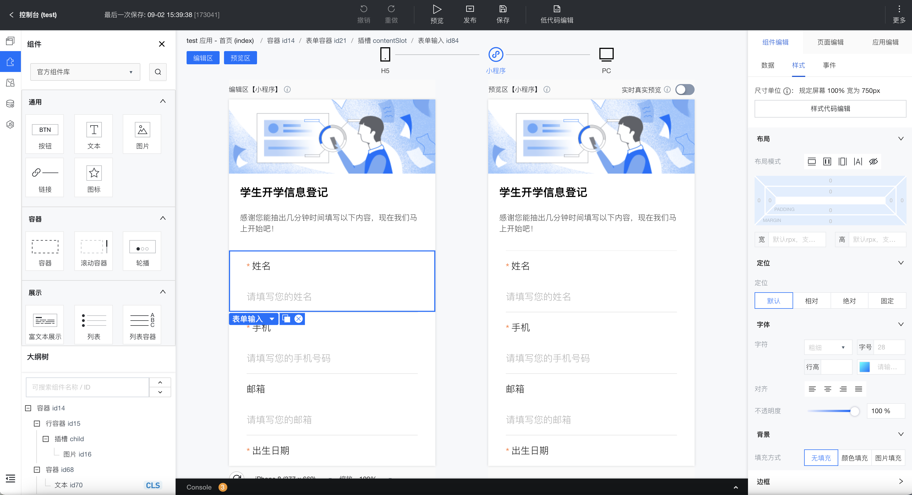

# 第6章 起源及发展

故事还得从十年前的九月六号（2011.9.6）说起。

> 十年之后，面对 iJEP 7 的 Code Complete，Kevin 将会回想起，他带着他的团队加入海辉软件的那个遥远的上午。
>
> 加西亚•马尔克斯的书，我没有坚持看完。

## 6.1 考古

2011年，我们团队从东南融通离开加入海辉软件（文思海辉的前身，中电金信的前前身），金融业务方向是操作风险（OpRisk aka ORM）。这是一个面向银行的全员流程类业务管理系统：纵向贯穿总分支行，横向横跨各条业务线，并且业务线需要垂直管理。这样的业务系统（操作风险），决定了其组织机构、数据权限是一种覆盖全行的矩阵式管理模式，造就了 iJEP 7 平台现有的机构权限模型。

> 致敬东南融通 IntelliPlatform！从它身上我学到了很多平台级的设计。

在海辉软件开展业务，要重新开发操作风险系统，面临无开发平台可用的局面。所以，我们就设计了 **J**ava **E**nterprise **P**latform，**JEP**。

其实最早还有两个候选名称：

1. 其中一个是 Java Enterprise Explore Platform，缩写为 JEEP，不错的一个名称，但是一个通用常见单词（吉普车），不利于后续软著等的申请，就放弃了；
2. 另外一个是简单粗暴型 Java Enterprise Development Platform，缩写为 JEDP，这个缩写无法发音。考虑到这个平台不仅要提供开发时能力，也要提供运行时支持，所以就把其中的 Development 去掉，最终就是现在的 JEP（一直持续到 JEP 5） 平台。

2018 年的时候，我们部门的业务往 AI+Data 转型，开发同业竞品分析平台产品，并尝试运营，在互联网上有一个公网服务，叫**查呗**。

> 配套这个产品，开发了一个非常强大的、赶超八爪鱼的爬虫产品 iCrawler，后来由于数据安全监管法律等原因，于 2019 年连同查呗一起下线，现存于归档代码库。

为了做这个**查呗**产品，JEP 5 平台面向互联网应用做了一次大的升级，但现在回想起来还是太保守了：

- 还是使用的 JSP 技术，只是添加了 Bootstrap；
- 并没有做前后端分离；
- 还好的是去掉了 Hibernate 这个厚重的持久层框架。

基于区别之前面向内部管理应用的 JEP 平台的考虑，我们仿照苹果 iPhone 的方式添加了一个单词 **i**nternet  **J**ava **E**nterprise **P**latform，**iJEP** 版本编号 6。

很快，2019年，iJEP 平台顺应技术趋势做了一次升级，采用了前后端分离技术，采用的技术栈为：

- 后端 Spring Boot/Cloud；
- 前端 Vue + iView。

这个版本命名为 iJEP 6.3，同时提供 iJEP 6.3 mini 单体应用开发平台，应对 200 万以下合同额的项目/产品交付。

2020年，疫情期间，我们就开始规划 iJEP 7（资源受限，正式开始做已经到了国庆节后了），就是你现在用的这个版本。

从现在回头看，当时规划 iJEP 7 时的一些决定还是很明智的：

1. 面向社会资源设计：低代码方向，减少人员数量和质量依赖；
1. 前端抛弃 iView，转向 Element；
1. 全套字段级数据权限和可配置的数据审计功能；
1. 场景式智能表单，不要画布式（类似 VB）智能表单，限制开发人员自由发挥空间；
1. 中央控制器，降低项目交付数据不一致性缺陷；
1. 面向业务的、独立部署的流程引擎；
1. 可配置的规则引擎（计划中，资源受限还未开展，iJEP 8 规划了这块功能）。

> 后疫情时代，我们面临的最大挑战就是：业务多了，薪资合理的合格开发人员少了。
>
> 线上化业务增多和人口红利减少是最主要的原因。

大约在 2021 年 5 月，iJEP 7 基本上可独立支持外部项目/产品开发：

1. 第 1 个支持的外部项目就是日照银行押品系统；
2. 第 2 个支持的项目是四川农信信访项目；
3. 第 3 个支持的项目是渣打银行法律合规管理系统。

iJEP 7 的中文名称是：低代码应用开发平台。其主要特色是面向场景的智能表单和面向业务的流程引擎。

经过我们在综合信贷中台产品研发过程中的验证，智能表单场景（21 类常见场景，并在持续增加中）可支持大约 80% 的前端界面配置。

> 上面这个复杂页面是通过智能表单配置出来的，不需要写前端代码。

面向业务的流程引擎，可以支持在浏览器中设计完整的、可运行的流程模板。

iJEP/JEP 平台还有个吉祥物，是头大象：

其出现在我写的 Eclipse 代码生成器插件中：

> 为什么是大象？
>
> 我家孩子小名叫大象。

## 6.2 致谢

在 iJEP/JEP 发展的 10 年里，有很多牛人、大拿做出了不可磨灭的贡献，从时间先后顺序排列感谢主要的设计者、开发者：

1. 周勇，我们团队最早的架构师，初始代码贡献者。从 2009 年开始，我和他就在东南融通共事，一个性格好得吓人的帅哥，四川老乡，现在新浪金融；
2. 马敏，iJEP 平台领导者、首席架构师、核心代码贡献者，没有他就没有 iJEP 的今天。从 2004 年开始，我和他就在联合金投公司共事，一个技术狂人，一个大年初一都要写代码的人，一个对代码有洁癖的人；
3. 侯银科，2015年加入文思海辉公司，一直参与 iJEP 平台设计开发，主要的代码贡献者。一个执行力很强的人，一个代码写得很快的人，一个写完自己代码还要帮别人写的人，一个家里有矿还热衷于写代码的人；
4. 兰亮，2020年3月2日加入中电金信公司，一直参与 iJEP 平台设计开发，主要的代码贡献者，一个能干肯干、关键时刻能冲在第一线能打仗的人，擅长工作流引擎。
5. 张光勇，2011年9月6日加入海辉软件，召集者；
6. 还有很多兄弟姐妹对 iJEP/JEP 做出了贡献，无法一一列举，感谢你们。

## 6.3 概览

iJEP 7 平台是一个以应用为核心的微服务架构开发平台，其主要特点是流程驱动+低代码开发。

iJEP 7 平台面向金融行业的业务管理类软件开发场景设计，可以支持像综合信贷中台这一类软件的开发：

### 6.3.1 设计理念

iJEP 7 以长期的金融行业产品研发及项目交付实践为基础，总结经验，提炼了设计开发规范，形成了 iJEP 7 架构规范，包括命名、接口定义、服务定义、数据标准化等。

在新的产品和项目交付过程中，通过制度的形式和代码走查的方式约束开发人员。

同时，平台提供代码生成器，内置上述架构规范和最佳开发实践，为开发人员生成新功能的满足架构要求的骨架代码，开发人员只需要为其填充业务逻辑代码即可。

> iJEP 7 平台就是要把作文题变成填空题。

通过上述工具层面的支持，体现**“面向社会资源设计：低代码方向，减少人员数量和质量依赖”**原则，多快好省地完成软件交付工作，做到**千人一码**，以利于软件资产的长期维护、演进。

### 6.3.2 架构设计

iJEP 7 的总体架构如下，红色部分为 iJEP 提供的功能：

> DAP：面向交易的开发平台，如核心银行存取款、计息、转账；
>
> MADP：面向移动端的开发平台，如移动信贷、移动CRM。

iJEP 7 在中电金信数字底座中的位置是承上启下：对接 DAP 交易服务，为 MADP 提供后端服务。

iJEP 7 主要由微服务基础开发平台、基础服务、低代码平台和系统管理（基础管理、组织机构、管理门户、消息中心）功能组成。

其主要组件有：

- 分布式架构：基于 Spring Cloud 的分布式架构，较强的横向扩展能力，使用 Consul 作为注册中心，使用 Apollo 作为配置中心；服务监控基于 Skywalking 和 promethus；
- 数据访问：基于 MyBatis 的通用数据访问封装，支持批量处理、简单和复杂查询，支付关联查询和统计查询，支持数据权限、字段权限、自定义权限等多种权限控制方式，对开发完全透明；
- 流程中心：基于 Flowable 开发的业务流程中心，提供可视化业务流程开发和中国式工作流，支持流程监控、流程预警；
- 规则中心：基于 Drools 的规则中心，支持规则集、规则树、评分表等；
- 调度中心：基于 Quartz 的分布式调度中心，使用 Spring Batch 处理批量数据，兼具批量处理功能；
- 低代码平台：基于统一的服务契约与服务分层，统一报文格式，支持在线设计，支持开发模式与生产模式；支持多种业务管理场景（当前是 21 种场景）的开发，支持复杂组合页面，支持向导模式；集成图表报表模式，前后端分离，支持报文加密；
- 系统管理：组织机构用户管理、菜单角色权限管理、数据字典、消息中心等基础功能。

iJEP 7 功能架构及其依赖关系如下：

以 iJEP 7 平台开发的应用软件，自带**系统管理**功能，可以直接开始开发业务功能。

在开发框架方面，采用了严格的三层架构，在后台 Java 层提供了基础的服务和类以支持后端业务逻辑的开发，在前端，在 Vue + Element 的基础上，平台封装了必要的组件，并提供了智能表单设计引擎和智能表单渲染引擎。

微服务开发层面，平台提供一系列的基础开发接口，并以代码生成器为主提供了新功能的骨架代码，并且生成代码的模板可根据交付需要进行定制。

### 6.3.3 低代码概览

iJEP 7 开发平台低代码能力主要体现在前端，在通常情况下，软件交付团队不需要配置前端开发人员。

以智能后台为支撑，智能前台提供了智能表单设计引擎和智能表单渲染引擎，支持前端设计和展现。

其次，流程引擎是面向业务设计的，可在线设计、部署流程。

使用 iJEP 7 进行低代码开发的典型流程如下：

前提条件是系统完成需求分析并做了数据库设计：

1. 使用代码生成器，连接到数据库，选取需要生成骨架代码的数据库表，生成代码（只有后端 Java 代码），并将代码拷贝到开发工程中；
2. 启动开发工程，iJEP 7 自动扫描实体类，识别单表业务模型。如果有多表关联的业务模型，请通过平台提供的界面，设计组合模型。如果有报表需要的统计模型，也请通过平台提供的界面，设计统计模型；
3. 识别/设计完业务模型后，可通过平台提供的智能表单设计器，选择需要的场景（当前支持 21 种场景）完成智能表单的设计、授权等工作；
4. 如果需要业务流程，就设计流程模板，并在流程用户节点上挂接智能表单、在自动任务上指定后台服务方法、在流程列表的表格上挂接流程，完成业务流程的整合；
5. 为新开发的业务功能设置菜单、为角色授权菜单访问权限；
6. 使用对应角色的人员登录系统，即可访问新开发（配置）的功能。

> 低代码/无代码开发流程，请参考**“第5章 快速开始”**。

### 6.3.4 流程引擎

流程引擎基于开源 Flowable 设计，提供了业务层扩展。

主要功能有：

1. 流程业务中心：提供面向业务的基于浏览器的可视化流程设计器，并和平台的权限体系、智能表单进行了有机整合。提供了通用的审批功能和界面；
2. 流程控制中心：提供面向中国式柔性工作流的扩展，如前后加签、前分裂后分裂、会签、挂起、任意跳转、指定操作人等功能；
3. 流程监控中心：提供流程引擎的监控服务，包括流程运行情况、历史流程、流程预警、流程统计等功能。

流程引擎在微服务场景下，独立部署为流程能力中心，其典型的使用场景如下：

流程中心依赖 iJEP 7 的系统服务（ijep-service-sys-7.0.0-SNAPSHOT.jar），可调用规则引擎中的规则服务。

其他业务服务（微服务）通过 REST 方法调用流程中心的服务。

流程引擎为了提高运行时效率，历史流程及流程审批记录等信息存放在 Elasticsearch 中，业务交互数据存放在 Redis 缓存中。

流程引擎还支持更细化、更定制化的使用场景：

流程引擎为业务开发人员提供了友好的流程设计器。

### 6.3.5 决策引擎

决策引擎因为用途原因，有些地方也叫规则引擎，但总的来说，决策引擎应该是要大于规则引擎的。

在我们的业务中，决策引擎大致用在信贷域的评分卡部分，通常和流程引擎关联使用。

早期，在 iJEP 6 中有一个简单的基于 Drools 7 做的规则引擎，主要完成反欺诈规则的设定和管理：

平台还提供了一个简单的可视化规则编辑器，以方便业务人员配置规则：

后期引入商业的决策引擎，可向最终客户提供源码，以完成客户的自主可控。

决策引擎是典型的能力中心服务部署方式，与其他系统的交互是通过 REST 调用进行的。

### 6.3.6 报表引擎

在 JEP 5 的时代，报表引擎用的是开源的 Eclipse BIRT，典型的集中式单体应用。

从 iJEP 6 开始，我们做了前后端分离，BIRT 已经不能适应这种部署方式，并且使用起来并不友好。费了很大的劲儿，几乎把所有的网上帖子都翻了个遍，也没有找到合适的集成方法。

后来找到了上海锐道公司开源的 UReport 2，最后集成到了 iJEP 7 中，基本可用，也够用。

> 小型项目使用 UReport 2 能够满足少量报表的在线设计、展示需求。
>
> 大型项目客户有专门的报表中心，不需要我们提供。

iJEP 7 中集成的在线报表设计器，可以结合**统计业务模型**在线设计报表。

在运行时，报表支持各种导出功能，足够好用。

### 6.3.7 智能表单

智能表单，是 iJEP 7 平台低代码开发能力的主要组件，分为设计时和运行时两个组件。

智能表单的目标是：

1. 提供在线设计工具，让后端程序员在前后端分离的时代能够管控前端做一个全栈工程师，知道自己做的软件是啥样的；
2. 让项目经理回归**垂直分配工作模式**：功能A给程序员张三，功能B给程序员李四。

智能表单的作用是：

1. 减少前后端沟通，消除前后端**阻抗失配**；
2. 提高交付效率，降低交付成本的同时提高交付质量。

> 我们的口号是：让程序员早点儿下班。

业界低代码平台的表单大部分是参照早期 VB、Delphi 的窗口设计器模式，以画布的形式提供界面设计功能，并配置一些特定的领域逻辑支持前端操作。

例如腾讯的微搭：

当前市场中的主要低代码提供商：

当前低代码平台市场供应商的格局：

我们的 iJEP 7 低代码设计模式是面向金融场景的，为**“减少人员技能依赖，提高交付效率，降低交付成本”**而设计的，根本特点是面向场景、模板驱动的：

1. 以最佳实践为模板；
2. 以设计工具适当控制开发人员的自由度；
3. 以平台产品级代码驱动项目交付代码，降低项目交付缺陷，提高交付质量。

当前，iJEP 7 提供 21 个模板，并在持续扩展中。

平台提供完善的表单设计器，约 70~80% 的前端界面可通过配置完成，无需手写 vue 代码。

智能表单支持两种方式的界面显示：

1. 动态渲染：将设计好的智能表单（配置信息为 json 串）直接保存到数据库，运行时由**智能表单渲染引擎**在前端直接渲染为表单界面；
2. 静态代码：将设计好的智能表单生成代码，将其拷贝到前端工程中，用 VS Code 等开发工具进一步微调修改界面 vue 文件，以传统方式完成前端的开发、修改工作。

运行时在客户 Chrome 浏览器中渲染的表单：

## 6.4 小结

本章对 iJEP 7 的发展历史做了回顾，也对这个平台的设计初衷、设计原则和设计模式做了简要的说明。

作为一个全程参与者，感慨万千，我也算是坚守了**“十年磨一剑”**的工匠精神初心。

> 你要是问我的理想是什么？
>
> 我的答案是：让我写的软件影响更多的人，帮助更多的人。
>
> 再高大上一些就是：数字科技成就美好世界。

后续的 iJEP 8 会以 DDD 的方式进化，往前进一步，踏入建模领域，继续为**“降本增效”**服务。

请看到这里的小伙伴，再回到上一章**“第5章 快速开始”**，仔细体会一下这个低代码应用开发平台的设计原则。
