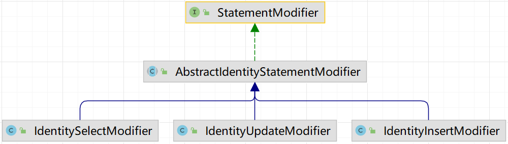
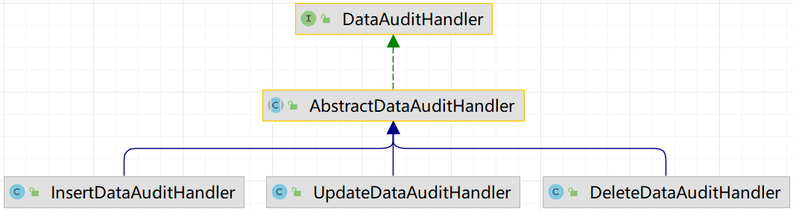
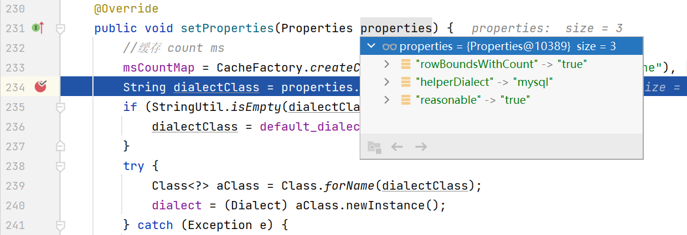
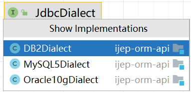
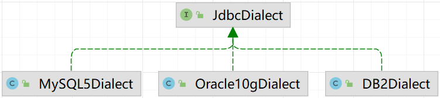

# 第9章 数据访问

iJEP 7 的数据访问 ORM 框架使用的是 MyBatis，增强框架是[通用 Mapper](https://github.com/abel533/Mapper) 3.4.0 扩展，分页插件使用的是 [PageHelper](https://github.com/pagehelper/Mybatis-PageHelper) 5.13。

平台通过 ijep-autoconfigure-orm 模块，使用 JepOrmAutoConfiguration 完成数据访问层的自动装配工作。

## 9.1 自动装配

在 MyBatis 中配置了 3 个插件：分页插件、多租户插件和性能计量插件。

```java
@Configuration
@EnableConfigurationProperties(JepOrmProperties.class)
@ConditionalOnProperty(prefix = "jep.orm", value = "enabled", matchIfMissing = true)
@EnableTransactionManagement //配置事务管理器
public class JepOrmAutoConfiguration implements TransactionManagementConfigurer {
...
    @Bean(name = "sqlSessionFactory")
    public SqlSessionFactory getSqlSessionFactory() {
        SqlSessionFactoryBean sqlSessionFactory = new SqlSessionFactoryBean();
...
        //分页插件
        PageInterceptor pageInterceptor = new PageInterceptor();
        pageInterceptor.setProperties(jepOrmProperties.getMybatis().getPageProps());
        //多租户插件
        IdentityInterceptor identityInterceptor = new IdentityInterceptor();
        //性能计量插件
        PerformanceInterceptor performanceInterceptor = new PerformanceInterceptor();

        //添加插件
        sqlSessionFactory.setPlugins(new Interceptor[]{identityInterceptor, pageInterceptor, performanceInterceptor});
...  
```

- 分页插件 PageInterceptor 使用的是 PageHelper 5.1.3，不同的数据库方言，对分页的；
- 多租户插件 IdentityInterceptor 完成租户管理及组织权限、字段权限和自定义权限管理；
- 性能度量插件 PerformanceInterceptor 完成 SQL 执行性能的度量和使用 DataAuditHandler 完成数据审计工作。

> 组织权限、字段权限和自定义权限放置的位置不合适，需要重构为数据权限插件；
>
> 数据审计放的位置不合适，需要重构为数据审计插件。

SQL 语句修改器




数据审计 DataAuditHandler



iJEP 7 中的**“组织权限”**是通过在 select 语句中增加对机构编码的过滤条件来完成的

通用 Mapper 中的 BaseSelectProvider 类

```java
public String selectAll(MappedStatement ms) {
    final Class<?> entityClass = getEntityClass(ms);
    //修改返回值类型为实体类型
    setResultType(ms, entityClass);
    StringBuilder sql = new StringBuilder();
    sql.append(SqlHelper.selectAllColumns(entityClass));
    sql.append(SqlHelper.fromTable(entityClass, tableName(entityClass)));
    sql.append(SqlHelper.orderByDefault(entityClass));
    return sql.toString();
}
```


从生成的骨架代码反推
配置文件 application-dev.yml 中 jep.orm.mybatis.page-props.helperDialect 和 jep.orm.jdbc.dialect 开始查找和数据库方言相关的内容 JdbcConfig、MybatisConfig


iJEP 7 的数据访问层是由 ijep-autoconfigure-orm 模块装载配置的。

配置文件 application-dev.yml 中对数据库方言有两个设定：orm.mybatishelper.page-props.helperDialect（分页查询，PageHelper 插件用） 和 jdbc.dialect（数据权限用TODO 还要补充）：

```yaml
jep:
  orm:
    mybatis:
      page-props:
        helperDialect: mysql
        reasonable: 'true'
        rowBoundsWithCount: 'true'
      conf-props:
        jdbcTypeForNull: 'NULL'
        callSettersOnNulls: 'true'
      mapper-locations: classpath*:/com/pactera/**/mapper/*.xml
    jdbc:
      current-schema: ijep7
      dialect: mysql
```

由配置类 JepOrmProperties 来承载配置文件 application-dev.yml 中数据访问的配置信息：

```java
package com.pactera.jep.autoconfigure.orm.conf;
...
@ConfigurationProperties("jep.orm")
public class JepOrmProperties {
	@NestedConfigurationProperty
	private JdbcConfig jdbc;

	@NestedConfigurationProperty
	private MybatisConfig mybatis;
...
```

- com.pactera.jep.autoconfigure.orm.conf.MybatisConfig 类承载 jep.orm.mybatis 的配置；
- com.pactera.jep.autoconfigure.orm.conf.JdbcConfig 类承载 jep.orm.jdbc 的配置。

在 JepOrmAutoConfiguration 自动配置类中注入 JepOrmProperties 配置信息类：

```java
package com.pactera.jep.autoconfigure.orm;
...
@Configuration
@EnableConfigurationProperties(JepOrmProperties.class)
@ConditionalOnProperty(prefix = "jep.orm", value = "enabled", matchIfMissing = true)
@EnableTransactionManagement //配置事务管理器
public class JepOrmAutoConfiguration implements TransactionManagementConfigurer {
    @Autowired
    private JepOrmProperties jepOrmProperties;
...
    @Bean
    public DatabaseIdProvider getDatabaseIdProvider() {
        DatabaseIdProvider dip = new VendorDatabaseIdProvider();
        Properties props = new Properties();
        props.put("DB2", "db2");
        props.put("Oracle", "oracle");
        props.put("MySQL", "mysql");
        props.put("DM DBMS", "mysql");
        dip.setProperties(props);
        return dip;
    }

    @Bean(name = "sqlSessionFactory")
    public SqlSessionFactory getSqlSessionFactory() {
        SqlSessionFactoryBean bean = new SqlSessionFactoryBean();
        bean.setDataSource(dataSource);
        bean.setDatabaseIdProvider(getDatabaseIdProvider());
...
    

@Bean()
public JdbcDialect getJdbcDialect() {
    if (JdbcConfig.DIALECT_MYSQL.equalsIgnoreCase(jepOrmProperties.getJdbc().getDialect())) {
        return new MySQL5Dialect();
    } else if (JdbcConfig.DIALECT_DB2.equalsIgnoreCase(jepOrmProperties.getJdbc().getDialect())) {
        return new DB2Dialect();
    } else if (JdbcConfig.DIALECT_MYSQL.equalsIgnoreCase(jepOrmProperties.getJdbc().getDialect())) {
        return new Oracle10gDialect();
    }
    return new MySQL5Dialect();
}
```


MyBatis 插件，其中分页插件中使用了 orm.mybatishelper.page-props.helperDialect

```java
public class JepOrmAutoConfiguration implements TransactionManagementConfigurer {
    @Bean(name = "sqlSessionFactory")
    public SqlSessionFactory getSqlSessionFactory() {
        //分页插件
        PageInterceptor pageInterceptor = new PageInterceptor();
        pageInterceptor.setProperties(jepOrmProperties.getMybatis().getPageProps());
        //多租户插件
        IdentityInterceptor identityInterceptor = new IdentityInterceptor();
        //添加插件
        bean.setPlugins(new Interceptor[]{identityInterceptor, pageInterceptor, new PerformanceInterceptor()});
...
```

分页插件 PageInterceptor 装载配置信息，以适应不同的数据库



最终由 com.github.pagehelper.page.PageHelper 插件的 PageAutoDialect 类使用配置文件 application-dev.yml 中的 orm.mybatishelper.page-props.helperDialect 配置信息：

```java
package com.github.pagehelper.page;
...
public class PageAutoDialect {
...
    public void setProperties(Properties properties) {
...
        String dialect = properties.getProperty("helperDialect");
...
```


在 JepOrmAutoConfiguration 类的 114 行，根据 jep.orm.jdbc.dialect 配置信息向 Spring 容器注册了 JdbcDialect 类，供后续数据访问中使用设置的数据库方言。

```java
@Bean()
public JdbcDialect getJdbcDialect() {
    if (JdbcConfig.DIALECT_MYSQL.equalsIgnoreCase(jepOrmProperties.getJdbc().getDialect())) {
        return new MySQL5Dialect();
    } else if (JdbcConfig.DIALECT_DB2.equalsIgnoreCase(jepOrmProperties.getJdbc().getDialect())) {
        return new DB2Dialect();
    } else if (JdbcConfig.DIALECT_ORACLE_10G.equalsIgnoreCase(jepOrmProperties.getJdbc().getDialect())) {
        return new Oracle10gDialect();
    }
    return new MySQL5Dialect();
}
```


```java
package com.pactera.jep.orm.jdbc;
...
public class JdbcTemplateDao<T> extends SimpleJdbcTemplateDao<T> {
...
    @Autowired(required=true)
	JdbcDialect jdbcDialect;
...
	protected Page<T> find(final Page<T> page, final String sql, final Object...params)
	{
		/*获取分页内容*/
		int offset = (page.getPageNumber() - 1) * page.getPageSize();
		int limit = offset + page.getPageSize();
		
		String limitSql = jdbcDialect.getLimitString(sql, offset, limit);
		List<T> result = find(limitSql, params);
		page.setResult(result);
		
		return page;
	}
...
```


```java
package com.pactera.jep.orm.jdbc.dialect;
...
public class MySQL5Dialect implements JdbcDialect {
	
	public String getLimitString(String sql, int offset, int limit)
	{
		limit = limit - offset;
		String limitSql = sql + " limit ?, ?";
		limitSql = limitSql.replace(" limit ?, ?", " limit " + offset + ", " + limit);
		return limitSql;
	}
...
```


JdbcTemplateDao 

JdbcDialect




数据权限 SqlHelper 类

```java
com.pactera.jep.orm.mybatis.helper
public class SqlHelper {
...
    /**
     * 数据授权部分
     * @return
     */
    private static String wherePermit(Class<?> entityClass, String tableName, Configuration configuration)
    {
    	//TODO 数据库方言
		DBVendor vendor = DBVendor.mysql;
		try
		{
			vendor = DBVendor.valueOf(configuration.getDatabaseId());
		} finally {}

    	StringBuilder sql = new StringBuilder();
    	sql.append("<foreach collection=\"infos\" open=\"(\" close=\")\" item=\"info\" separator=\"or\">\n");
    	sql.append("<trim prefix=\"(\" prefixOverrides=\"or\" suffix=\")\">\n");
    	sql.append("<choose>\n");
    	sql.append("<when test=\"info.unit\">\n");
		sql.append(getDynamicTableName(entityClass, tableName) + ".${info.column} in (");
		sql.append(PermitStatementFactory.getPermitStatement(vendor, PermitType.UNIT));
		sql.append(")");
		sql.append("</when>\n");
...    
    /**
     * 数据字段授权部分
     * @return
     */
    private static String whereFieldPermit(Class<?> entityClass, String tableName, Configuration configuration)
    {
        StringBuilder sql = new StringBuilder();
        sql.append("<foreach collection=\"fields\" open=\"(\" close=\")\" item=\"field\" separator=\"and\">\n");
        sql.append("${field}\n");
        sql.append("</foreach>\n");
        return sql.toString();
    }
...
```


orm 实体ID（表的主键）SnowflakeIdWorkerUitl，被 IdWorkerGenerator 使用
EntityHelper
MapperTemplate

更远一些的是 gateway 中的 RequestHeaderFilter

com.pactera.jep.orm.mybatis.helper.SqlHelper，
com.pactera.jep.orm.mybatis.helper.PermitStatementFactory L704，数据授权部分，L756，数据字段授权部分

## 9.2 通用 Mapper

MyBatis 是一个轻量级 ORM 框架，单表 CRUD 需要写大量的重复代码。使用通用 Mapper 可以提供大量的通用 CRUD 方法，开发人员只需要写

## 9.3 数据分页

查询分页使用的是 PageHelper 5.1.3，

## 9.4 组织权限

组织权限类型的定义在 PermitType 固定数据字典这个枚举类中。 

> 以前那套组织权限已经废弃？

IdentitySelectModifier.modify 方法

```java
//92行
this.dataPermit(select);
//159行
tables(selectBody, propertyReadWritePermissions);
//193行
permit(selectBody, selectItems, (Table) fromItem, propertyReadWritePermissions);
```

permit 方法


## 9.5 字段权限

接口 PropertyReadWritePermission 定义了字段权限许可信息，PropertyReadWritePermissionImpl 是其实现，枚举类 PermitPropertyType 定义了字段数据权限的类型：编辑、查看、不支持。

IdentitySelectModifier 类中 dataPermit 方法使用字段权限完成查询 select 语句的修改。

IdentityInterceptor 租户拦截器类中的拦截方法，根据上下文创建 StatementModifier，然后修改

```java
@Intercepts({
	@Signature(method = "prepare", type = StatementHandler.class, args = {Connection.class, Integer.class})
})
public class IdentityInterceptor implements Interceptor {
...
	@Override
    public Object intercept(Invocation invocation) throws Throwable {
		StatementModifier modifier = IdentityModifierBuilder.newBuilder(...)
                                    .build();
```


## 9.6 自定义权限


## 9.7 数据库方言

iJEP 7 以提供不同的数据库方言的方式来适配不同的数据库。

不同的数据库脚本，可以通过 Navicat Premium 来转换，非常方便。

> 我从 MySQL 数据库转化成 SQL Server 数据库，只花费了几分钟的时间。




当需要移植到不同的数据库时，需要先完成 jdbc 驱动的准备工作：

- 在项目 pom.xml 中增加对应数据库的 jdbc 驱动依赖；
- 在 application-dev.yml 文件中配置正确的数据库连接信息，特别注意别忘了修改 helperDialect 和 dialect 属性值。

接下来对 iJEP 7 平台的代码进行扩展和修改，需要修改的地方有 6 个：

1. DBVendor 枚举类中添加新的数据库名称，如 sqlserver；
1. 添加数据库方言类 XXXDialect（如 SQLServerDialect）并实现 JdbcDialect 接口，参照现有数据库方言（MySQL5Dialect、Oracle10gDialect 或 Oracle10gDialect）重写对应方法（如 getLimitString、getColumnQueryString 方法）；
4. JdbcConfig 类中添加新的数据库名称，如 sqlserver。在 JepOrmAutoConfiguration.getJdbcDialect 方法中返回对应的数据库方言类（实现 JdbcDialect 接口）；
4. 在 JepOrmAutoConfiguration.getDatabaseIdProvider bean 方法中为 VendorDatabaseIdProvider 对象添加数据库方言标识，以供后续 MyBatis 通过 databaseId  支持在一个 mapper.xml 中支持不同的数据库；
6. 检查 ijep-sys-parent/ijep-sys-core/src/main/java/com/pactera/jep/sys/mapper 下的 *Mapper.xml 文件，针对不同的数据库，按照其语法修改其中的 SQL 语句；
5. 检查 ijep-bpm-parent/ijep-bpm-server/src/main/java/com/pactera/jep/workflow/wf/mapper 下的 *Mapper.xml 文件，针对不同的数据库，按照其语法修改其中的 SQL 语句。

> MyBatis 多数据库支持：在 XXXMapper.xml 中使用 databaseId 例如：<select id="isExist" resultType="Boolean" databaseId="mysql">，这个 databaseId 在 VendorDatabaseIdProvider 实例对象中设置，并设置到 SqlSessionFactoryBean 对象中。

最后，启动应用，哪里有错改哪里。
