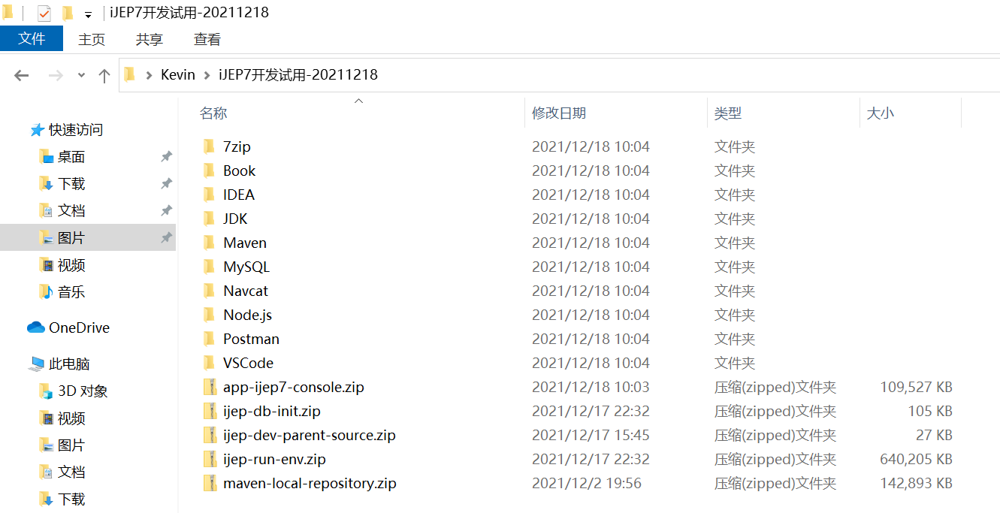
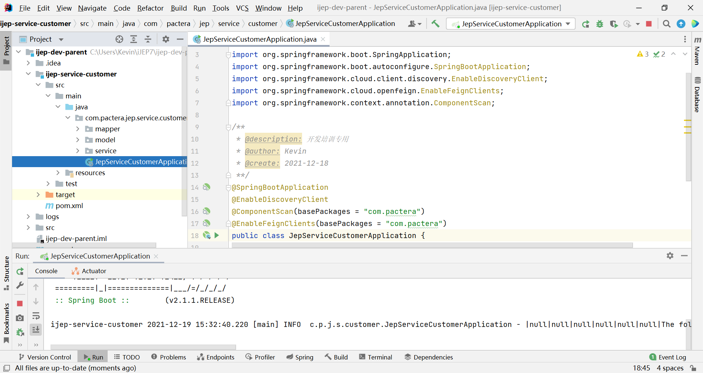
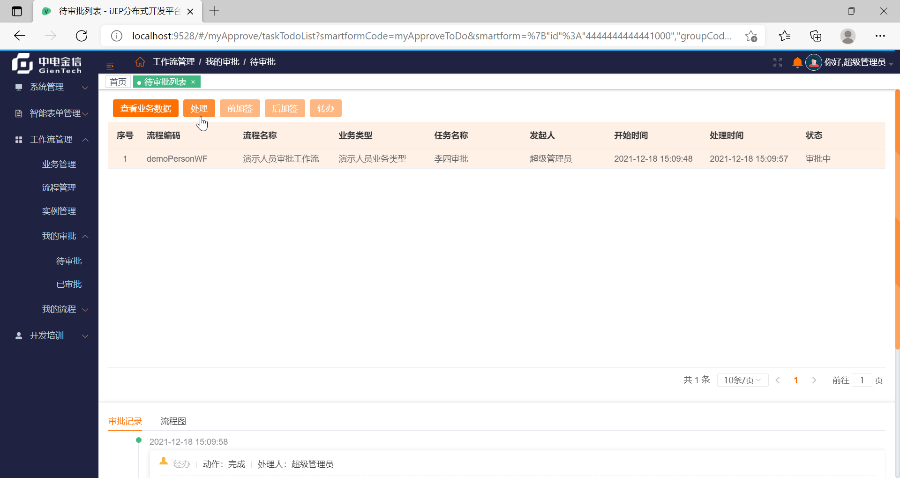

# 附录4 从零开始搭建开发环境

iJEP 7 是典型的微服务架构，其开发环境依赖于较多的基础设施。

一般而言，一个交付团队会有一个开发服务器，上面安装这些基础设施。

针对有（想）追（加）求（班）的个人独立开发者来说，安装一个完整的离线本地开发环境，那也是极好的。

> 安装完整的独立开发环境，机器配置建议 4核心 CPU 和 32G 内存，显卡无感。


本文将以一个刚安装完 Windows 10 的全新机器为例，详细介绍完整开发环境的搭建步骤。

本文采用 iJEP 7 开发包 20211218 版，以下简称**开发分发包**。



**iJEP7开发试用-20211218** 分发包说明：

1. 7zip：开源好用免费的压缩解压缩软件；
2. Book：iJEP Code Complete Uncomplete Version，部分章节；
3. IDEA：后端程序员撸代码神器；
4. JDK：后端 Java 开发人员吃饭的家伙；
5. Maven：标准构建工具，项目依赖管理工具；
6. MySQL：开源数据库，iJEP 7 原生开发数据库，当前已经支持 Oracle、达梦；
7. Navcat：数据库管理工具，好用到人手一份，但是我还同时使用 DbVisualizer 和 DB Solo，都很好用；
8. Node.js：一个基于 Chrome V8 引擎的 JavaScript 运行环境，前端开发必备；
9. Postman：一个接口测试工具，可以模拟用户发起的各类HTTP请求；
10. VSCode：微软出品的一款编写现代Web和云应用的跨平台源代码编辑器，前端开发神器；
11. app-ijep7-console.zip：iJEP 7 前端应用，请使用 VSCode 打开、开发；
12. ijep-db-init.zip：iJEP 7 的初始化数据库脚本；
13. ijep-dev-parent-source.zip：iJEP 7 的开发示例项目，使用 IDEA 打开、开发；
14. ijep-run-env.zip：iJEP 7 的基础运行环境，包含Redis、ES、Consul、Nginx、iJEP 7 网关、iJEP 7 系统服务、iJEP 7 流程引擎服务、和 ijep-dev-parent-source.zip 开发示例项目的打包微服务，及一些运行脚本；
15. maven-local-repository.zip：iJEP 7 的最小本地 Maven 依赖库。

## 附录4.1 基础设施

### 附录4.1.1 JDK

使用开发分发包里的 `iJEP7开发试用-20211218\JDK\jdk-8u311-windows-x64.exe` 安装。

> 也可到官网 [https://www.oracle.com/](https://www.oracle.com/) 下载最新版的 [jdk-8u311-windows-x64.exe](https://www.oracle.com/java/technologies/downloads/#java8)，然后安装。

双击 **jdk-8u311-windows-x64.exe** 启动安装：


请将 JDK 安装到不带中文和/或空格的路径下，例如 C:\Java\jdk1.8.0_311，同时，选择不安装公共 JERE：


设置 JAVA_HOME 环境变量：右键单击**我的电脑**，在右键弹出菜单中选择**属性**，**高级系统设置**，**环境变量**，**新建（系统变量）**，设置 JAVA_HOME 的变量值为 C:\Java\jdk1.8.0_311：


编辑**系统变量 path**，新建后输入：%JAVA_HOME%\bin\，将 java 虚拟机添加到系统访问路径，方便后续使用：


打开 Windows 命令行控制台，输入 `java -version`，检验 JDK 是否正确安装完毕。


### 附录4.1.2 Maven

使用开发分发包里的 `iJEP7开发试用-20211218\Maven\apache-maven-3.8.4-bin.zip` 安装。

> 也可到官网 [https://maven.apache.org/](https://maven.apache.org/) 下载最新版本的 [apache-maven-3.8.4-bin.zip](https://dlcdn.apache.org/maven/maven-3/3.8.4/binaries/apache-maven-3.8.4-bin.zip)，然后安装。

将 **apache-maven-3.8.4-bin.zip** 解压到 C:\Java，然后配置 MAVEN_HOME 环境变量：右键单击**我的电脑**，在右键弹出菜单中选择**属性**，**高级系统设置**，**环境变量**，**新建（系统变量）**，设置 MAVEN_HOME 的变量值为 C:\Java\apache-maven-3.8.4：


编辑**系统变量 path**，新建后输入：%MAVEN_HOME%\bin\，将 Maven 添加到系统访问路径，方便后续使用：


打开 Windows 命令行控制台，输入 `mvn -version`，检验 Maven 是否正确安装完毕。


修改 `C:\Java\apache-maven-3.8.4\conf\settings.xml`，注释掉如下内容：

```xml
<mirror>
    <id>maven-default-http-blocker</id>
    <mirrorOf>external:http:*</mirrorOf>
    <name>Pseudo repository to mirror external repositories initially using HTTP.</name>
    <url>http://0.0.0.0/</url>
    <blocked>true</blocked>
</mirror>
```

> Maven 在 3.8.1 的默认配置文件中增加了一组标签，如果仓库镜像是 http 而不是 https 就会被拦截禁止访问，而当前公司私服我们用的是 http。解决办法有两种，降低 Maven 版本库到 3.6 或像上面一样注释掉配置文件中的设置。

### 附录4.1.3 MySQL

使用开发分发包里的 `iJEP7开发试用-20211218\MySQL\mysql-5.7.35-winx64.zip` 和 `iJEP7开发试用-20211218\MySQL\vcredist_x64.exe` 安装。

> 也可到官网 [https://www.mysql.com/](https://www.mysql.com/) 下载 5.7 的最新版本的 [mysql-5.7.35-winx64.zip](https://downloads.mysql.com/archives/get/p/23/file/mysql-5.7.35-winx64.zip)，然后安装。
>
> 也可到官网 [https://www.microsoft.com/](https://www.microsoft.com/) 下载 [vcredist_x64.exe](http://download.microsoft.com/download/1/8/0/180fa2ce-506d-4032-aad1-9d7636f85179/vcredist_x64.exe)，然后安装。

在 Windows 10 下安装 MySQL 5.7.35，需要提前安装微软的 VC++2013 依赖库，双击 **vcredist_x64.exe** 安装该依赖库。


将 **mysql-5.7.35-winx64.zip**，解压到 `C:\Program Files\mysql-5.7.35-winx64`。

在 `C:\Program Files\mysql-5.7.35-winx64` 下创建 data 目录，然后创建 my.ini 文件，内容如下：

```ini
[mysql]
# 设置mysql客户端默认字符集
default-character-set=utf8 
[mysqld]
# 设置3306端口
port = 3306 
# 设置mysql的安装目录
basedir=C:\\Program Files\\mysql-5.7.35-winx64
# 设置mysql数据库的数据的存放目录
datadir=C:\\Program Files\\mysql-5.7.35-winx64\\data
# 允许最大连接数
max_connections=200
# 设置mysql服务端默认字符集
character-set-server=utf8
# 创建新表时将使用的默认存储引擎
default-storage-engine=INNODB 
# 注意这个参数，MySQL默认值导致在Windows 10 专业版上无法安装
innodb_flush_method=normal
```

以管理员身份运行命令行工具，并进入 `C:\Program Files\mysql-5.7.35-winx64` 目录，执行 MySQL 初始化命令 `mysqld --initialize-insecure`，在指定的目录中（数据目录配置 my.ini 配置文件中）初始化数据库，及生成无密码的 root 用户。

使用命令 `mysqld -install` 在Windows中安装MySQL系统服务；

使用命令 `net start mysql` 启动MySQL服务；

使用命令 `mysql -uroot -p` 登录MySQL数据库，提示输入密码时，直接回车；

使用命令 `set password = password('123456');` 修改root用户密码为123456。

### 附录4.1.4 Navcat

使用开发分发包里的 `iJEP7开发试用-20211218\Navcat\navicat160_mysql_cs_x64.exe` 安装。

> 也可到官网 [https://www.navicat.com.cn/](https://www.navicat.com.cn/) 下载最新版本的 [navicat160_mysql_cs_x64.exe](https://www.navicat.com.cn/download/direct-download?product=navicat_mysql_cs_x64.exe&location=1)，然后安装。

双击 **navicat160_mysql_cs_x64.exe** 启动安装：


打开 Navcat，新建 MySQL 数据库连接，用户名 root，密码 123456，然后连接到数据库，验证 Navcat 正确安装。


### 附录4.1.5 Postman

使用开发分发包里的 `iJEP7开发试用-20211218\Postman\postman-win64-9.4.1-setup.exe` 安装。

> 也可到官网 [https://www.postman.com/](https://www.postman.com/) 下载最新版本的 [postman-win64-9.4.1-setup.exe](https://dl.pstmn.io/download/latest/win64)，然后安装。

双击 **postman-win64-9.4.1-setup.exe** 完成安装并测试：


## 附录4.2 后端安装配置

后端开发使用 IDEA，项目构建工具使用了 Maven，所以需要安装 IDEA 并安装 iJEP 7 的离线本地 Maven 依赖库。

### 附录4.2.1 IDEA

使用开发分发包里的 `iJEP7开发试用-20211218\IDEA\ideaIU-2021.3.exe` 安装。

> 也可到官网 [https://www.jetbrains.com/idea/](https://www.jetbrains.com/idea/) 下载最新版本的 [ideaIU-2021.3.exe](https://download.jetbrains.com/idea/ideaIU-2021.3.exe)，然后安装。

双击 **ideaIU-2021.3.exe** 完成安装：


### 附录4.2.2 Maven本地库

使用开发分发包里的 `iJEP7开发试用-20211218\maven-local-repository.zip` 安装。

在 Windows 命令行控制台执行 `mkdir .m2` 命令，创建 maven 本地文件。


将 **maven-local-repository.zip** 解压到 C:\Users\Kevin\\.m2 目录：


### 附录4.2.3 后端项目

使用开发分发包里的 `iJEP7开发试用-20211218\ijep-dev-parent-source.zip` 安装。

将 **ijep-dev-parent-source.zip** 解压到 C:\Users\Kevin\iJEP7 目录，完成后端项目安装。

打开 Windows 命令行工具，进入 C:\Users\Kevin\iJEP7\ijep-dev-parent 目录，执行 `mvn package -DskipTests` 命令，下载必要的依赖文件，并检查是否可以正确打包：


### 附录4.2.4 后端支持环境

使用开发分发包里的 `iJEP7开发试用-20211218\ijep-run-env.zip` 安装。

将 **ijep-run-env.zip** 解压到 C:\Users\Kevin\iJEP7 目录。

> 后端运行环境包括：Redis、ES、Consul、iJEP 7 网关、iJEP 7 系统服务、iJEP 7 流程引擎服务，并提供可启动运行环境的批处理文件。


删除上图红色方框内的内容，在开发阶段前端使用开发模式，Nginx 前端用不上。

修改 start-ijep7.bat 文件，删除 Nginx 相关脚本和最后一行：因为开发示例工程后续将从 IDEA 中启动。

修改后的 start-ijep7.bat 文件内容：

```powershell
@echo off
%1 mshta vbscript:CreateObject("Shell.Application").ShellExecute("cmd.exe","/c %~s0 ::","","runas",1)(window.close)&&exit
cd /d "%~dp0"

start cmd /c "title consul && .\consul_1.10.4_windows_amd64\consul agent -dev"
start cmd /c "title redis && .\Redis-x64-3.2.100\redis-server.exe"
start cmd /c "title elasticsearch && .\elasticsearch-6.8.20\bin\elasticsearch.bat"

:: 延迟10秒
ping -n 10 127.0.0.1>nul

start cmd /c "title gateway && java -jar -Dfile.encoding=utf-8 .\ijep7-jars\ijep-router-gateway.jar"
start cmd /c "title sys && java -jar -Dfile.encoding=utf-8 .\ijep7-jars\ijep-service-sys.jar"

:: 延迟60秒后启动流程引擎，原因是流程引擎依赖sys服务
ping -n 60 127.0.0.1>nul

start cmd /c "title bpm && java -jar -Dfile.encoding=utf-8 .\ijep7-jars\ijep-service-bpm.jar"
```

### 附录4.2.5 设置主机名映射

在开发阶段，工程中使用 application-dev.yml 文件对 database、consul、redis、elasticsearch 等外部资源使用主机名的方式进行了配置。

请以管理员身份运行命令行工具，输入 notepad 启动记事本，打开 C:\Windows\System32\drivers\etc\hosts 文件，添加如下配置完成开发机的主机名 IP 映射：

```properties
127.0.0.1 server.consul
127.0.0.1 server.redis
127.0.0.1 server.elasticsearch
127.0.0.1 server.database
127.0.0.1 server.gateway
```

> 如果有其它机器担任服务器，请将其映射到对应的服务器 IP 地址。


### 附录4.2.6 创建开发数据库

随开发分发包分发的开发测试数据库是一个最小数据库，zip 后的大小为 52k。

请按照如下顺序创建并导入初始开发数据库：

1. 创建 ijep7 数据库；
2. 导入 ijep-db-init\flowable\flowable.mysql.all.create.sql，创建 flowable 表结构；
3. 导入 ijep-db-init\ijep7\ijep7.init.structure.create.sql，创建平台表结构；
4. 导入 ijep-db-init\ijep7\ijep7.init.data.sql，导入平台初始数据；
5. 导入 ijep-db-init\demo\ijep7.structure.dev.create.sql，创建开发演示数据表；
6. 导入 ijep-db-init\demo\ijep7.data.dev.sql，导入开发演示数据。


参考的 MySQL 命令行语句：

```bash
mysql -uroot -p

drop database ijep7;
create database ijep7;
use ijep7;

source C:/Users/Kevin/iJEP7/ijep-run-env/ijep7-db/flowable/flowable.mysql.all.create.sql;
source C:/Users/Kevin/iJEP7/ijep-run-env/ijep7-db/ijep7/ijep7.init.structure.create.sql;
source C:/Users/Kevin/iJEP7/ijep-run-env/ijep7-db/ijep7/ijep7.init.data.sql;
source C:/Users/Kevin/iJEP7/ijep-run-env/ijep7-db/demo/ijep7.structure.dev.create.sql;
source C:/Users/Kevin/iJEP7/ijep-run-env/ijep7-db/demo/ijep7.data.dev.sql;
```

使用 Navcat 检查数据库（一共 141 张表）创建情况：


## 附录4.3 前端安装配置

前端开发使用 VS Code，项目基于 Vue + Element 构建，需要的开发工具有：node.js 和 VS Code。

### 附录4.3.1 node.js

使用开发分发包里的 `iJEP7开发试用-20211218\Node.js\node-v16.13.1-x64.msi` 安装。

> 也可到官网 [http://nodejs.cn/](http://nodejs.cn/) 下载最新版本的 [node-v16.13.1-x64.msi](https://npmmirror.com/mirrors/node/v16.13.1/node-v16.13.1-x64.msi)，然后安装。

双击 **node-v16.13.1-x64.msi** 启动并完成安装：


### 附录4.3.2 VS Code

使用开发分发包里的 `iJEP7开发试用-20211218\VSCode\vscodeusersetup-x64-1.63.2.exe` 安装。

> 也可到官网 [https://code.visualstudio.com/](https://code.visualstudio.com/) 下载最新版本的 [VSCodeUserSetup-x64-1.63.2.exe](https://az764295.vo.msecnd.net/stable/899d46d82c4c95423fb7e10e68eba52050e30ba3/VSCodeUserSetup-x64-1.63.2.exe)，然后安装。

双击 **vscodeusersetup-x64-1.63.2.exe** 启动安装：


完成安装，打开 VS Code，会自动安装中文语言包。


### 附录4.3.3 前端项目

使用开发分发包里的 `iJEP7开发试用-20211218\app-ijep7-console.zip` 安装。

将 **app-ijep7-console.zip** 解压到 C:\Users\Kevin\iJEP7 目录，完成前端项目安装。

## 附录4.4 开发起步

在完成基础支撑环境和项目的安装配置之后，请依照以下顺序完成最终的开发环境搭建工作。

### 附录4.4.1 启动后端支持环境

双击 `C:\Users\Kevin\iJEP7\ijep-run-env\start-ijep7.bat`启动后端支持环境。


稍等 3~5 分钟，耐心等候后端支持环境启动完成，不要关闭下图中的 6 个命令窗口。


打开浏览器访问 [http://localhost:8500/ui/dc1/services](http://localhost:8500/ui/dc1/services)，查看 Consul 服务注册中心上的服务启动注册运行情况：


### 附录4.4.2 启动后端开发环境

启动 IDEA，打开 `C:\Users\Kevin\iJEP7\ijep-dev-parent` 项目。

设置 Maven 配置信息：


在 IDEA 中运行 JepServiceCustomerApplication，启动 ijep-service-customer 服务。



通过 Consul 控制台，检查 ijep-service-customer 服务是否正确注册到 Consul 中。


### 附录4.4.3 启动前端开发环境

启动 VS Code，打开 `C:\Users\Kevin\iJEP7\app-ijep7-console` 项目。


在 VS Code 中新建终端，输入命令 `npm run dev`，启动前端应用。


稍后，前端应用启动完毕，会自动打开浏览器，进入登录页面，使用 superAdmin（密码 123456）登录：


### 附录4.4.4 验证 iJEP 7 功能

在**“工作流管理 > 流程管理”**功能里启用流程。


在**“开发培训 > 演示人员管理-流程”**功能里面选择编码为 3525 的第一条记录，单击**提交**按钮，提交审批，启动工作流。


在**“工作流管理 > 我的审批 > 待审批”**功能里面选择第一条（也是唯一的一条）数据，单击**处理**按钮：

> 开发数据库内置的这支简化工作流，所有的节点都是指定 superAdmin 来操作。



输入处理意见后，单击**同意**按钮，完成第一步审批：


回到**“开发培训 > 演示人员管理-流程”**功能里面选择编码为 3525 的第一条记录，单击**审批流程**按钮，查看业务流程办理情况：


当前业务流转情况是完成第一步审批，等待最后一步审批：


到此，完成开发环境的搭建验证工作。

## 附录4.5 前进一步

在完成开发环境搭建后，请参考 iJEP 7 开发手册，在后端开发项目（比如 `ijep-dev-parent\ijep-service-customer`）中完成业务逻辑的开发，在 iJEP 7 管理控制台（`app-ijep7-console` 运行时，通过浏览器操作）中配置智能表单、配置流程，配合后端业务逻辑完成软件项目的常规业务功能交付。

如果你的业务功能界面超出智能表单当前提供的场景（当前提供 21 种场景）范围，则需要使用“自定义组件”方式创建智能表单引用配置。


自定义表单本质上就是 vue 原生开发，请使用 VS Code 在前端项目 `app-ijep7-console` 中编写 vue 文件。


iJEP 7 的系统管理功能，早于智能表单之前完成开发，绝大多数都是原生的 vue 文件（前端项目中的文件路径是 src/views/system/\*\*/\*.vue），可供需要时参考：


